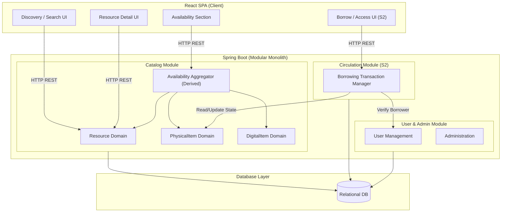
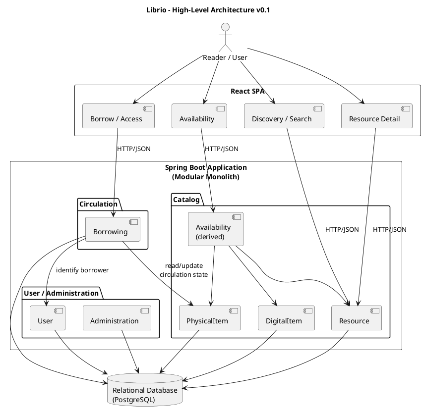

# D03 — High-Level Design (HLD) & System Architecture — Librio

**Project:** Librio  
**Document:** High-Level Design (HLD) Baseline v0.1  
**Status:** Baseline sau Analysis & Architecture Alignment  
**Owners:** HH — Technical/Backend, PL — Frontend/Design, KL — Requirement/QA  
**Related:** D03 SRS Baseline | D03 LLD Baseline  

---

## 1. Architectural Style & Technology Stack

Hệ thống **Librio** được thiết kế theo phong cách kiến trúc **Modular Monolith** nhằm tối ưu tốc độ phát triển cho MVP, đảm bảo tính đơn giản trong vận hành nhưng vẫn duy trì sự phân tách rõ ràng về ranh giới domain (domain boundary).

```text
┌────────────────────────────────────────────────────────┐
│                      React SPA                         │
│   (Single Page Application - Client-side Rendering)    │
└───────────────────────────┬────────────────────────────┘
                            │ REST / HTTP JSON
                            ▼
┌────────────────────────────────────────────────────────┐
│               Spring Boot Application                  │
│                 (Modular Monolith)                     │
│  ┌──────────────┐   ┌──────────────┐   ┌─────────────┐ │
│  │   Catalog    │   │ Circulation  │   │ User/Admin  │ │
│  └──────────────┘   └──────────────┘   └─────────────┘ │
└───────────────────────────┬────────────────────────────┘
                            │ JPA / JDBC Persistence
                            ▼
┌────────────────────────────────────────────────────────┐
│                  Relational Database                   │
│             (PostgreSQL / Relational DB)               │
└────────────────────────────────────────────────────────┘
```

- **Frontend:** React SPA (Vite, React Router).
- **Backend:** Java + Spring Boot (Modular Monolith).
- **Database:** Relational Database (PostgreSQL).
- **Protocol:** HTTP/RESTful APIs (JSON Payload).

---

## 2. Domain & Backend Module Boundaries

Hệ thống Backend được phân chia ranh giới theo 3 Modules chính:

```text
Spring Boot Application
├── Catalog Module         (Sở hữu dữ liệu tài liệu & khả dụng)
│   ├── Resource
│   ├── PhysicalItem
│   ├── DigitalItem
│   └── Availability       (Derived Capability — Không phải Table riêng)
│
├── Circulation Module     (Sở hữu nghiệp vụ mượn/trả tài liệu)
│   └── Borrowing
│
└── User / Admin Module    (Sở hữu tài khoản & quản trị hệ thống)
    ├── User
    └── Administration
```

### 2.1 Catalog Module
- **Trách nhiệm:** Quản lý toàn bộ dữ liệu *"Những gì thư viện sở hữu"*.
- **Entities chính:** `Resource` (thông tin tài liệu), `PhysicalItem` (bản sao vật lý), `DigitalItem` (bản số hóa).
- **Availability Capability:** Trạng thái khả dụng được tính toán động (derived) từ `PhysicalItem.status` và sự tồn tại của `DigitalItem`, **không lưu cứng thành Table trong DB**.

### 2.2 Circulation Module
- **Trách nhiệm:** Quản lý toàn bộ lịch sử và giao dịch mượn/trả sách.
- **Entities chính:** `Borrowing` (lịch sử mượn trả liên kết `User` và `PhysicalItem`).
- **Ranh giới:** Circulation phụ thuộc vào `PhysicalItem` của Catalog Module để kiểm tra và cập nhật trạng thái mượn (`status`).

### 2.3 User / Administration Module
- **Trách nhiệm:** Quản lý tài khoản đọc giả, thủ thư và cấu hình hệ thống (MVP Support Module).

---

## 3. High-Level Request Flows

### 3.1 Flow 1: Search / Browse Resources (S1 Scope)
```text
React UI ──► Catalog API ──► Catalog Module ──► ResourceRepository ──► Database
```

### 3.2 Flow 2: Resource Detail & Availability (S1 Scope)
```text
React UI ──► Catalog API ──► Catalog Module ──► Aggregate (Resource + PhysicalItems + DigitalItem) ──► JSON Response
```
*Lưu ý HLD:* Availability được gộp trực tiếp vào Response payload của `GET /resources/{id}`, không tách thành micro-service hay API riêng lẻ.

### 3.3 Flow 3: Borrow Resource (Future Scope - S2 Boundary Note)
```text
React UI ──► Circulation API ──► Circulation Module ──► [ Transaction Boundary ] ──► Update PhysicalItem Status & Create Borrowing ──► Database
```

---

## 4. Architecture Diagrams

### 4.1 Sơ đồ Mermaid Component Architecture (Code-First)



### 4.2 Sơ đồ PlantUML Architecture v0.1



---

## 5. Architectural Boundary & Design Notes

### 5.1 Layering Boundary (Controller ➔ Service ➔ Repository ➔ DB)
Mặc dù sơ đồ HLD thể hiện các Component kết nối xuống DB, cấu trúc thực tế trong từng Module Backend phải tuân thủ nghiêm ngặt mô hình 3 lớp:
```text
Controller (HTTP Boundary) ➔ Service (Business Boundary) ➔ Repository (Persistence Boundary) ➔ DB
```

### 5.2 Circulation ➔ Catalog Dependency & Transaction Boundary
- `Circulation Module` phụ thuộc vào `PhysicalItem` của `Catalog Module`.
- **Yêu cầu Transactional Boundary:** Thao tác mượn sách (`Borrow`) bắt buộc phải bọc trong một **Server-Side Atomic Transaction** bao gồm cả 2 hành động:
  1. Tạo bản ghi `Borrowing` mới.
  2. Cập nhật `PhysicalItem.status = 'BORROWED'`.
- Nếu 1 trong 2 hành động thất bại, toàn bộ giao dịch phải `ROLLBACK` để tránh hiện tượng vỡ dữ liệu (*Borrowing active nhưng PhysicalItem vẫn AVAILABLE*).
- *Chi tiết locking strategy (Optimistic vs Pessimistic) được hoãn lại đến LLD Sprint 2.*

---

## 6. Architectural Decisions Log (HLD Baseline Freeze)

| Hạng mục Decision | Quyết định Architecture | Trạng thái |
| :--- | :--- | :--- |
| **Architecture Pattern** | **Modular Monolith** (Single Spring Boot Artifact) | **Confirmed** |
| **Frontend Framework** | **React SPA** | **Confirmed** |
| **Communication Protocol**| **REST / HTTP JSON** | **Confirmed** |
| **Catalog Boundary** | Sở hữu Resource, PhysicalItem, DigitalItem | **Confirmed** |
| **Circulation Boundary** | Sở hữu Borrowing History & Circulation logic | **Confirmed** |
| **Availability Entity** | **Derived Capability**, không tạo DB table riêng | **Confirmed** |
| **Borrow Transaction** | Bắt buộc có **Atomic Transactional Boundary** | **Required** |
| **Database Engine** | **Relational Database (PostgreSQL)** | **Confirmed** |
| **Authentication / AuthZ**| Spring Security / JWT Baseline | **Deferred (TBD)** |
| **Deployment Strategy** | Single Instance / Docker Container | **Deferred (TBD)** |
