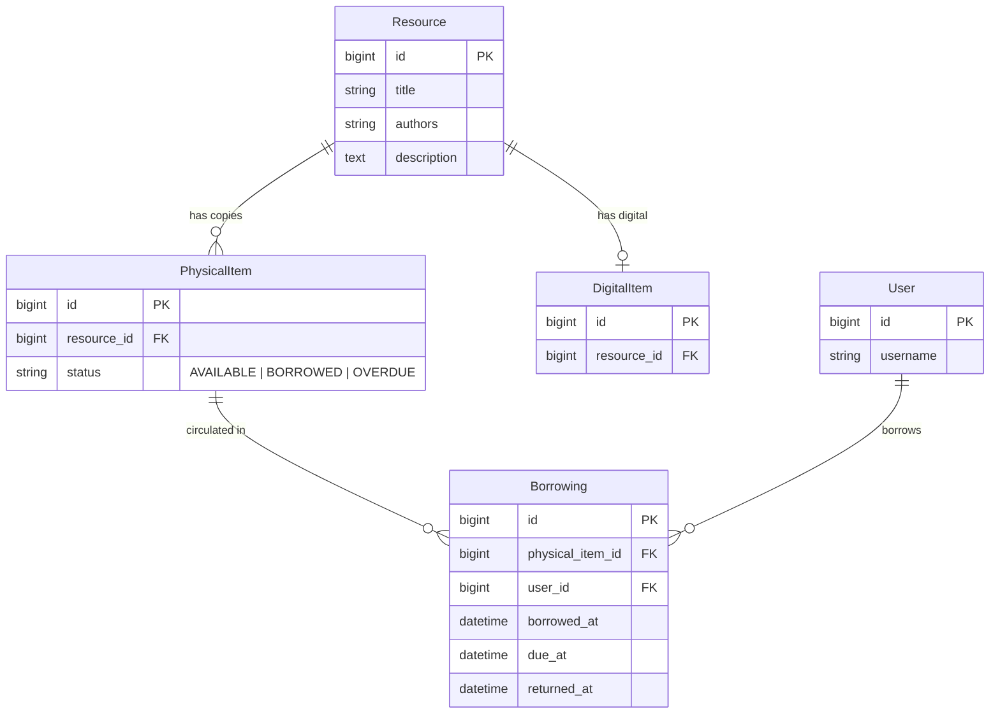
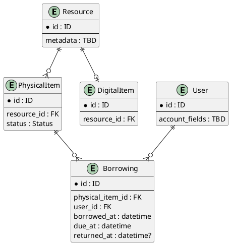
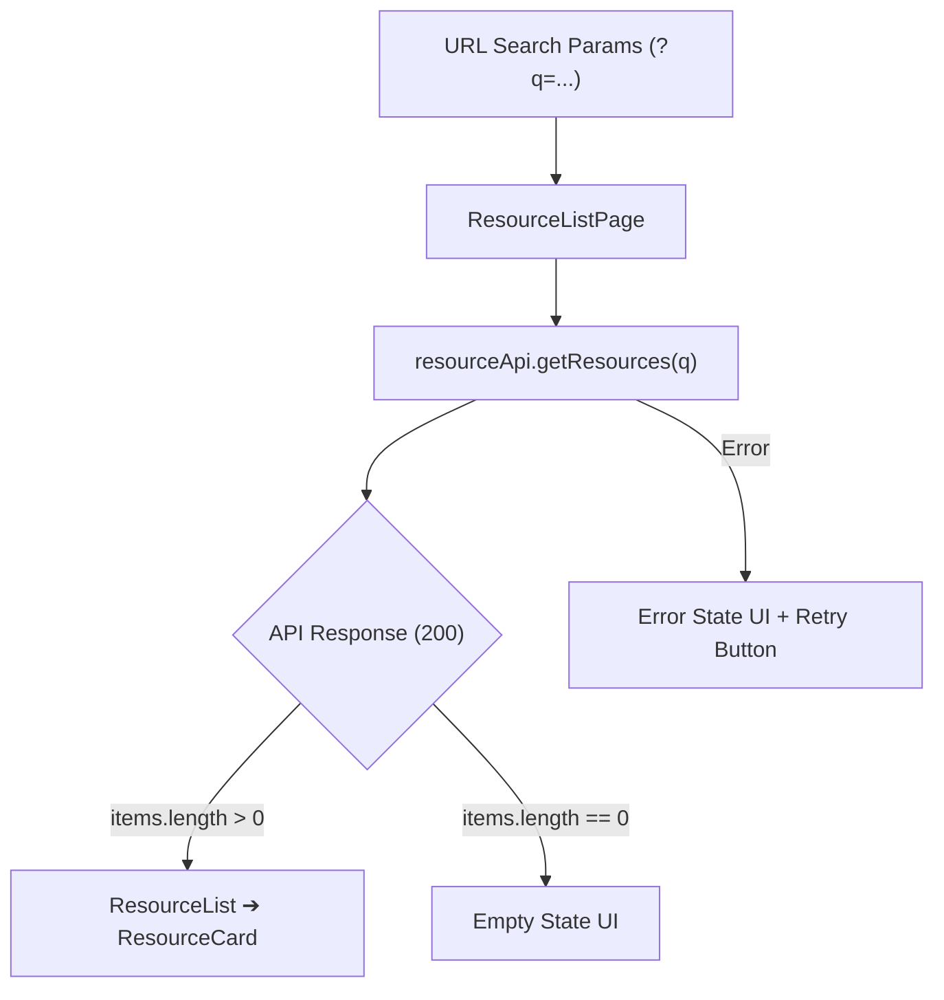
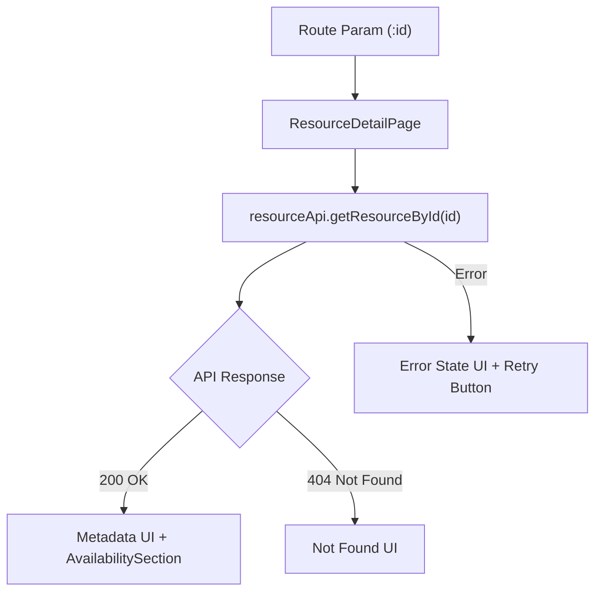

# D03 — Technical Design & Low-Level Design (LLD) — Sprint 1 Baseline

**Project:** Librio  
**Sprint:** S1 — 13/08–19/08/2026  
**Status:** Baseline sau analysis/design (Đã đóng băng ngày 17/8)  
**Owners:** HH — Technical/Backend, PL — Frontend/Design/QA, KL — Requirement/Verification  
**Related:** D02 WBS | D04 Source Code  

---

## 1. Mục đích & Phạm vi Sprint 1

Tài liệu này là **bản tổng hợp duy nhất** về Thiết kế Kỹ thuật Chi tiết (LLD) cho cả **Frontend và Backend** trong Sprint 1. Tài liệu kết hợp toàn bộ domain model, database ERD, API contract, kiến trúc component Frontend, quy tắc hiển thị UI và bộ test scenario kiểm thử.

Sprint 1 tập trung vào luồng Core Reader:

```text
Resource List / Browse ──► Search Resources ──► Resource Detail ──► Availability Check
```

### 1.1 In Scope
- **Reader-Facing:** Browse/Search tài liệu, xem trang chi tiết, hiển thị Access Type (Physical / Digital / Both), xem khả dụng bản vật lý & bản số hóa, xử lý các trạng thái UI (loading, empty, error, not found).
- **Backend:** Domain model, Database ERD (PostgreSQL/SQL), Availability aggregation logic, 2 Read APIs (`GET /resources`, `GET /resources/{id}`).
- **Frontend:** Component architecture, URL query state management, API service client, UI state machine.

### 1.2 Out of Scope
- Physical borrowing / Return / Reservation execution.
- Concurrency control / Transactional locking (triển khai ở Sprint 2).
- Digital unavailable state (Sprint 1: có record `DigitalItem` ➔ `available = true`).
- Authentication / Authorization.
- Pagination & Search ranking algorithms.

---

## 2. Kiến trúc Tổng quan (HLD Context) & Module Boundary

### 2.1 Architeture Overview

```text
┌────────────────────────────────────────────────────────┐
│                      React UI                          │
│  ResourceListPage / ResourceDetailPage / SearchInput   │
│  AvailabilitySection / resourceApi Service             │
└───────────────────────────┬────────────────────────────┘
                            │ HTTP / JSON REST APIs
                            ▼
┌────────────────────────────────────────────────────────┐
│                   Spring Boot API                      │
│  ResourceController ──► ResourceService ──► Repository │
│  (Availability Aggregation Logic)                      │
└───────────────────────────┬────────────────────────────┘
                            │ JPA / JDBC Query
                            ▼
┌────────────────────────────────────────────────────────┐
│                      Database                          │
│  Resource | PhysicalItem | DigitalItem | Borrowing     │
└────────────────────────────────────────────────────────┘
```

### 2.2 Phân định Trách nhiệm (Backend ↔ Frontend Boundary)
- **Backend (HH):** Chịu trách nhiệm truy xuất DB, validate dữ liệu, tính toán sẵn Availability, và trả về JSON Payload chuẩn hóa.
- **Frontend (PL):** Chịu trách nhiệm gọi API, quản lý UI state (loading/empty/error/not found), render đúng dữ liệu từ contract. **Frontend tuyệt đối không tự tính toán lại availability từ data khác.**

---

## 3. Thiết kế Cơ sở Dữ liệu (Database Design & ERD)

### 3.1 Sơ đồ ERD (Code-First Mermaid)



<details>
<summary>Source PlantUML</summary>


</details>

### 3.2 Mô tả Chi tiết Entities & Rules
- **`Resource`:** Chứa thông tin tổng quan tài liệu (`title`, `authors`, `description`).
- **`PhysicalItem`:** Bản sao vật lý cụ thể. `status` gồm: `AVAILABLE` (sẵn sàng mượn), `BORROWED` (đang mượn), `OVERDUE` (quá hạn).
- **`DigitalItem`:** Bản số hóa (`1 Resource` có `0..1 DigitalItem` cho MVP).
- **`Borrowing`:** Lịch sử mượn trả. Invariant: Mỗi `PhysicalItem` có tối đa 1 active borrowing (`returned_at IS NULL`).

---

## 4. Backend Logic — Aggregation Model

Availability được tính toán động (derive) khi Backend nhận request Detail:

```text
Resource ──┬──► PhysicalItem[] ──► COUNT ──► physical: { totalCopies, availableCopies }
         └──► DigitalItem?   ──► EXISTS ─► digital: { available }
```

1. **Physical Availability:**
   - `totalCopies = COUNT(PhysicalItem WHERE resource_id = :id)`
   - `availableCopies = COUNT(PhysicalItem WHERE resource_id = :id AND status = 'AVAILABLE')`
2. **Digital Availability:**
   - Nếu tồn tại record `DigitalItem` tương ứng ➔ `digital.available = true`.
   - Nếu không có `DigitalItem` ➔ Bỏ hẳn (omit) block `digital` khỏi JSON response.

---

## 5. API Contracts & Specifications (Backend API)

### 5.1 Search / Browse API: `GET /resources?q={keyword}`
- **Success Response (`200 OK`):**
```json
{
  "items": [
    {
      "id": 1,
      "title": "Clean Code",
      "authors": ["Robert C. Martin"]
    }
  ]
}
```
- **Empty Response (`200 OK` - Khi không tìm thấy):**
```json
{
  "items": []
}
```

### 5.2 Resource Detail API: `GET /resources/{id}`
- **Response Cả Physical & Digital (`200 OK`):**
```json
{
  "id": 1,
  "title": "Clean Code",
  "authors": ["Robert C. Martin"],
  "description": "A handbook of agile software craftsmanship.",
  "accessTypes": ["PHYSICAL", "DIGITAL"],
  "physical": {
    "totalCopies": 5,
    "availableCopies": 2
  },
  "digital": {
    "available": true
  }
}
```
- **Response Chỉ Physical (`200 OK` - Omit Digital):**
```json
{
  "id": 2,
  "title": "Refactoring",
  "authors": ["Martin Fowler"],
  "description": "Improving the design of existing code.",
  "accessTypes": ["PHYSICAL"],
  "physical": {
    "totalCopies": 3,
    "availableCopies": 0
  }
}
```
- **Not Found Error (`404 Not Found`):**
```json
{
  "message": "Resource not found"
}
```

---

## 6. Frontend Architecture & Component Design (PL)

### 6.1 Cấu trúc Thư mục Frontend (`src/`)
```text
src/
├── pages/
│   ├── ResourceListPage.jsx      # Màn hình Browse/Search danh sách
│   └── ResourceDetailPage.jsx    # Màn hình Xem chi tiết & Availability
├── components/
│   ├── SearchInput.jsx           # Input nhập từ khóa tìm kiếm (Controlled)
│   ├── ResourceList.jsx          # Container render danh sách cards hoặc Empty State
│   ├── ResourceCard.jsx          # Card hiển thị tóm tắt thông tin tài liệu
│   └── AvailabilitySection.jsx   # Widget hiển thị trạng thái Physical/Digital
├── services/
│   └── resourceApi.js            # Service layer gọi API và bắt lỗi
├── routes/
│   └── AppRoutes.jsx             # Định tuyến URL /resources và /resources/:id
└── types/
    └── resource.js               # Type definition cho DTO
```

### 6.2 Phân rã Component & Trách nhiệm

| Component | Trách nhiệm chính |
|---|---|
| `AppRoutes` | Đăng ký route `/resources` và `/resources/:id`. |
| `ResourceListPage` | Đọc URL search query (`?q=...`), gọi `resourceApi.getResources()`, quản lý UI states (loading, empty, error). |
| `SearchInput` | Nhập, trim khoảng trắng và push keyword lên URL search params khi submit. |
| `ResourceList` | Render danh sách `ResourceCard` hoặc hiển thị UI Empty State khi mảng rỗng. |
| `ResourceCard` | Hiển thị tóm tắt title, authors và link chuyển sang `/resources/:id`. |
| `ResourceDetailPage` | Đọc `id` từ Route params, gọi `resourceApi.getResourceById(id)`, quản lý state detail/404/error. |
| `AvailabilitySection` | Hiển thị số bản vật lý (`availableCopies / totalCopies`) và trạng thái bản điện tử (`Available`). |
| `resourceApi` | Thực hiện các HTTP GET request, chuẩn hóa lỗi cho UI. |

### 6.3 Quy tắc Hiển thị UI & State Machine (Frontend Rules)
- **Loading:** Đang fetch API ➔ Hiển thị Skeleton/Spinner, **chưa hiển thị Empty/Not Found**.
- **Empty Search:** API trả `200` với `items: []` ➔ Hiển thị màn hình *"Không tìm thấy tài liệu phù hợp"*.
- **404 Not Found:** API Detail trả `404` ➔ Hiển thị màn hình *"Tài liệu không tồn tại"*.
- **Network / API Error:** API lỗi/mất mạng ➔ Hiển thị thông báo lỗi kèm nút **Retry**.
- **Physical Block:** Nếu `accessTypes` chứa `PHYSICAL` ➔ Render số bản `availableCopies / totalCopies`.
- **Digital Block:** Nếu `accessTypes` chứa `DIGITAL` ➔ Render badge **Available**.
- **Both Access Types:** Render cả 2 khối Physical và Digital độc lập.

### 6.4 Data Flow Frontend Diagrams (Mermaid)

#### Search / Browse Flow


#### Resource Detail Flow


---

## 7. API Response ➔ Frontend UI Mapping

Bảng quy ước ánh xạ trực tiếp dữ liệu từ JSON Payload của Backend lên giao diện Frontend:

| Backend JSON Field         | Scope UI sử dụng           | Cách render trên UI |
| :------------------------- | :------------------------- | :------------------ |
| `id`                       | Key & Route navigation     | Chuyển hướng sang `/resources/{id}` |
| `title`                    | Resource Card & Detail     | Tiêu đề chính (`<h2>`, `<h1>`) |
| `authors`                  | Resource Card & Detail     | Nối chuỗi tác giả (`author1, author2`) |
| `description`              | Resource Detail Page       | Đoạn văn mô tả chi tiết tài liệu |
| `accessTypes`              | Availability Section       | Quyết định render thẻ Physical, Digital hay cả hai |
| `physical.totalCopies`     | Physical Availability Badge| Mẫu số trong hiển thị stock (`5`) |
| `physical.availableCopies` | Physical Availability Badge| Tử số trong hiển thị stock (`2` / `5 available`) |
| `digital.available`        | Digital Access Badge       | Hiển thị nhãn **Available** |

---

## 8. Bộ Test Scenarios Kiểm thử (Verification Matrix - KL / QA / PL)

Bộ 18 kịch bản kiểm thử thực tế được dùng để nghiệm thu tính hợp lệ của Implementation ngày 18-19/8:

| ID | Scenario Kiểm thử | Thao tác | Expected Result (Kết quả kỳ vọng) |
|---|---|---|---|
| **TC01** | Browse resources | Truy cập `/resources` | Hiển thị danh sách tài liệu mặc định |
| **TC02** | Search có kết quả | Gõ từ khóa hợp lệ ➔ Submit | Hiển thị danh sách tài liệu phù hợp |
| **TC03** | Search không có kết quả | Gõ từ khóa không tồn tại ➔ Submit | Hiển thị màn hình Empty State |
| **TC04** | Search chỉ chứa khoảng trắng | Gõ `"   "` ➔ Submit | Auto-trim từ khóa, tải danh sách mặc định |
| **TC05** | Select Resource Card | Click vào 1 Resource Card | Chuyển hướng đúng route `/resources/{id}` |
| **TC06** | Mở resource hợp lệ | Mở ID tồn tại trong DB | Hiển thị đầy đủ Metadata và Availability |
| **TC07** | Resource ID không tồn tại | Mở `/resources/999999` | Hiển thị màn hình 404 Not Found |
| **TC08** | Resource chỉ có Physical | Mở tài liệu loại Physical-only | Chỉ hiển thị khối Physical, không có Digital |
| **TC09** | Resource chỉ có Digital | Mở tài liệu loại Digital-only | Chỉ hiển thị khối Digital, không có Physical |
| **TC10** | Resource có cả hai | Mở tài liệu có cả bản in & bản số | Hiển thị song song cả 2 khối Physical & Digital |
| **TC11** | Physical còn bản | Resource có `availableCopies > 0` | Hiển thị số bản khả dụng (ví dụ: `2 / 5 available`) |
| **TC12** | Physical hết bản | Resource có `availableCopies = 0` | Hiển thị `0 / 5 available` hoặc Unavailable |
| **TC13** | Digital available | Resource có `digital.available = true` | Hiển thị badge Available kèm nút truy cập |
| **TC14** | Digital unavailable | *(Out of scope S1)* | *(Mặc định S1 không xuất hiện case này)* |
| **TC15** | API đang xử lý | Mạng chậm / đang fetch API | Hiển thị Loading State (Skeleton/Spinner) |
| **TC16** | API/Network lỗi | Tắt Backend / Lỗi mạng | Hiển thị Error State kèm nút Retry |
| **TC17** | Retry thành công | Bật lại Backend ➔ Click Retry | Xóa thông báo lỗi và tải lại dữ liệu thành công |
| **TC18** | Chuyển nhanh giữa 2 resource | Click nhanh ID=1 rồi chuyển sang ID=2 | Bỏ qua response cũ, chỉ render dữ liệu ID=2 |

---

## 9. Design Decisions Matrix (Đã Đóng Băng Ngày 17/8)

| Hạng mục Thiết kế | Quyết định Thống nhất (Frozen Baseline) |
| :--- | :--- |
| **Availability Entity** | **Không tạo Entity riêng**, derive động từ `PhysicalItem.status`. |
| **Availability Endpoint** | **Gộp vào `GET /resources/{id}`**, không tách API riêng. |
| **Missing Access Block** | **Omit block** (không có digital thì không trả field `digital`, không để `null`). |
| **Search Response** | Schema dạng `{ "items": [...] }`. |
| **Error Format** | Schema đơn giản `{ "message": "Resource not found" }`. |
| **Digital Status S1** | Nếu có record `DigitalItem` ➔ Mặc định `available = true`. |

---

## 10. Deviation & Implementation Log (Cập nhật sau ngày 18–19/8)

*Mục này dành cho HH, PL và KL cập nhật các điểm thay đổi thực tế giữa Implementation và Baseline sau khi kết thúc đợt dev & test.*

| Baseline Specification | Actual Implementation | Reason for Deviation | Impact / Action Required |
| :--- | :--- | :--- | :--- |
| *(VD: API Response format)* | *(Thực tế code)* | *(Lý do thay đổi)* | *(Cập nhật doc/code)* |
| *(TBD ngày 18-19/8)* | *(TBD)* | *(TBD)* | *(TBD)* |
