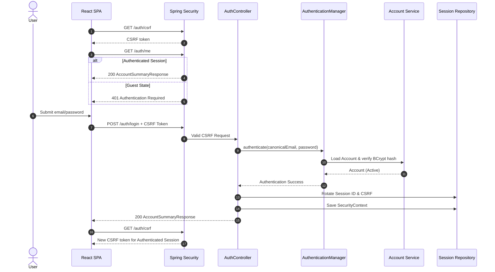
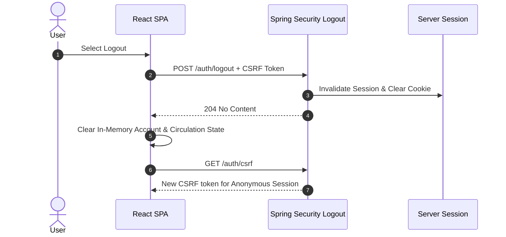
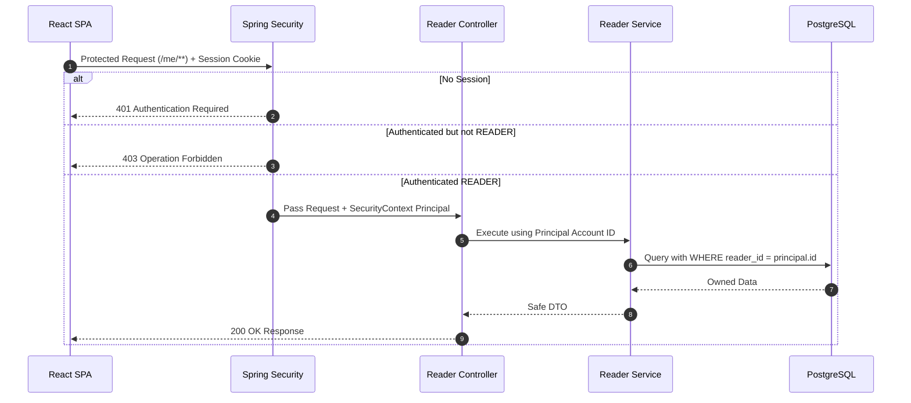

# Librio — Sprint 2 Authentication & Authorization Low-Level Design

**Project:** Librio | **Sprint:** Sprint 2 (20/08/2026–25/08/2026)  
**Design source:** T-072 | **Requirement:** T-071 & Sprint 2 SRS | **HLD:** [architecture.md](../hld/architecture.md)

---

## 1. Domain Model & Identity
### 1.1 Account Entity & Reader Identity
Application sử dụng entity `Account` (bảng `accounts`). Trong Sprint 2, `Account` có role `READER` chính là Reader Identity (chưa tách `ReaderProfile`). Các bảng Circulation liên kết trực tiếp qua `readerId -> Account.id`.

| Field | Description | Rules |
| :--- | :--- | :--- |
| `id` | BigInt | Primary Key, Immutable Identity. |
| `email` | String | Unique, Normalized (Lowercase + Trimmed). |
| `passwordHash` | String | BCrypt Hash (`strength=12`). Không bao giờ trả về API DTO. |
| `displayName` | String | Tên hiển thị người dùng. |
| `role` | Enum | `READER` hoặc `LIBRARIAN`. Không hỗ trợ multi-role. |
| `accountStatus` | Enum | `ACTIVE` hoặc `DISABLED`. |
| `createdAt` / `updatedAt` | Timestamp | Standard audit fields. |

> **Bảo mật Identity:** Backend lấy Reader ID từ authenticated principal trong server-side session. Reader-facing operation tuyệt đối không nhận `readerId` do client tự gửi trong request body/param.

### 1.2 Email Canonicalization
Trước khi lưu hoặc truy vấn account, email phải được normalize: **Trim khoảng trắng ở 2 đầu + Chuyển toàn bộ về Lowercase**.
*Ví dụ:* `"  Reader@Librio.Local  "` ➔ `"reader@librio.local"`.
*Lưu ý:* Không áp dụng quy tắc riêng của Gmail (không xóa dấu `.`, không bỏ `+tag`). `reader@gmail.com` và `reader+demo@gmail.com` là 2 tài khoản riêng biệt.

---

## 2. Access Matrix & API Contracts
### 2.1 Access Control Matrix

| Endpoint Group | Method | Required Access | CSRF Protection |
| :--- | :--- | :--- | :--- |
| Public Discovery (`/resources/**`) | GET | Public | Không |
| CSRF Bootstrap (`/auth/csrf`) | GET | Public | Không |
| Login (`/auth/login`) | POST | Public | **Bắt buộc** |
| Current Account (`/auth/me`) | GET | Authenticated | Không |
| Logout (`/auth/logout`) | POST | Authenticated | **Bắt buộc** |
| Reader Operations (`/me/**`, request mượn) | ANY | Authenticated (`ROLE_READER`) | **Bắt buộc** cho State-changing |
| Librarian Operations (`/circulation/**`) | ANY | Authenticated (`ROLE_LIBRARIAN`) | **Bắt buộc** cho State-changing |

*Lưu ý:* Chuẩn API không có prefix `/api`. Default access policy dùng **Deny-by-default**.

### 2.2 Endpoint Details & DTO Shapes

#### `GET /auth/csrf`
* **Response (200 OK):** `CsrfTokenResponse` `{ "token": "...", "headerName": "X-CSRF-TOKEN", "parameterName": "_csrf" }`

#### `POST /auth/login`
* **Headers:** `Content-Type: application/json`, `X-CSRF-TOKEN: <token>`
* **Request DTO (`LoginRequest`):** `{ "email": "string (required)", "password": "string (required)" }`
* **Success Response (200 OK - `AccountSummaryResponse`):**
  ```json
  {
    "id": 1,
    "email": "reader@librio.local",
    "displayName": "Demo Reader",
    "role": "READER",
    "accountStatus": "ACTIVE"
  }
  ```
* **Failure Response (401 Unauthorized / 400 Bad Request):** Xem phần 2.3.

#### `GET /auth/me`
* **Response:** 200 OK với `AccountSummaryResponse` nếu đã đăng nhập; `401 Unauthorized` nếu chưa.

#### `POST /auth/logout`
* **Headers:** `X-CSRF-TOKEN: <token>`
* **Response:** `204 No Content` (Xóa SecurityContext, invalidate server session & clear cookie).

### 2.3 Error Handling & Standard Error Response
Toàn bộ Auth/Security exception trả về dạng JSON chuẩn (`ApiErrorResponse`), không redirect HTML login page và không lộ stacktrace/SQL error.

```json
{
  "status": 401,
  "code": "INVALID_CREDENTIALS",
  "message": "Invalid email or password",
  "timestamp": "2026-08-24T20:30:00+07:00"
}
```

| HTTP Status | Error Code | Nguyên nhân |
| :--- | :--- | :--- |
| `400 Bad Request` | `VALIDATION_ERROR` | Request body thiếu field hoặc sai định dạng. |
| `401 Unauthorized` | `AUTHENTICATION_REQUIRED` | Gọi protected endpoint nhưng chưa có session hợp lệ. |
| `401 Unauthorized` | `INVALID_CREDENTIALS` | Sai email, sai password, hoặc account đang `DISABLED`. |
| `403 Forbidden` | `OPERATION_FORBIDDEN` | Đã đăng nhập nhưng không có Role tương ứng (ví dụ Reader gọi Librarian API). |
| `403 Forbidden` | `CSRF_TOKEN_INVALID` | CSRF token bị thiếu, không hợp lệ hoặc hết hạn. |

---

## 3. Spring Security & Custom JSON Login Architecture
### 3.1 Authentication & Security Context Flow
Vì Spring Security mặc định hỗ trợ form-login/HTTP Basic, việc đăng nhập JSON yêu cầu `AuthController` điều phối quy trình xác thực và chủ động lưu trữ SecurityContext.

```java
// Logic thứ tự xử lý Custom JSON Login
Authentication authentication = authenticationManager.authenticate(
    new UsernamePasswordAuthenticationToken(canonicalEmail, rawPassword)
);

// 1. Chống Session Fixation & Rotate CSRF Token
sessionAuthenticationStrategy.onAuthentication(authentication, request, response);

// 2. Tạo & Thiết lập SecurityContext
SecurityContext context = securityContextHolderStrategy.createEmptyContext();
context.setAuthentication(authentication);
securityContextHolderStrategy.setContext(context);

// 3. Persist context vào HTTP Session
securityContextRepository.saveContext(context, request, response);
```

### 3.2 Session & Cookie Management
* **Session Policy:** `SessionCreationPolicy.IF_REQUIRED` (Server-side Session, không dùng JWT).
* **Cookie Configuration:**
  - `Local`: `HttpOnly=true`, `SameSite=Lax`, `Secure=false`, `Path=/`
  - `Production`: `HttpOnly=true`, `SameSite=Lax`, `Secure=true`, `Path=/`
* **CSRF Token:** Được lưu trữ theo Session. Frontend lưu token trên RAM memory, lấy token mới khi khởi chạy app và sau khi Login/Logout. Không lưu CSRF token hay session data vào `localStorage`.

### 3.3 Password & Seed Account Policy
* **Password Encoding:** Sử dụng `BCryptPasswordEncoder` với `strength = 12`.
* **Seed Accounts (Dev/Test profile):** Khởi tạo `reader@librio.local` và `librarian@librio.local`. Password lấy trực tiếp từ Environment Variables (`LIBRIO_SEED_READER_PASSWORD`, `LIBRIO_SEED_LIBRARIAN_PASSWORD`). Nếu thiếu env var, app sẽ fail-fast ngay khi khởi động. Tuyệt đối không hard-code password trong source code.

---

## 4. Sequence Diagrams
### 4.1 Application Bootstrap & Login Flow


### 4.2 Logout Flow


### 4.3 Protected Reader Operation Flow


---

## 5. Deployment & Routing Configuration
* **Frontend Fetching:** Gọi API bằng Relative URL (`fetch('/auth/me', { credentials: 'include' })`).
* **Vite Dev Proxy (`vite.config.js`):** Route `/auth`, `/resources`, `/me` sang `http://localhost:8080`.
* **Production Deployment:** Single-site deployment (`https://librio.example.com/`). Reverse proxy (Nginx/Cloudflare) sẽ route các path backend trước khi fallback về `index.html` của React SPA.
