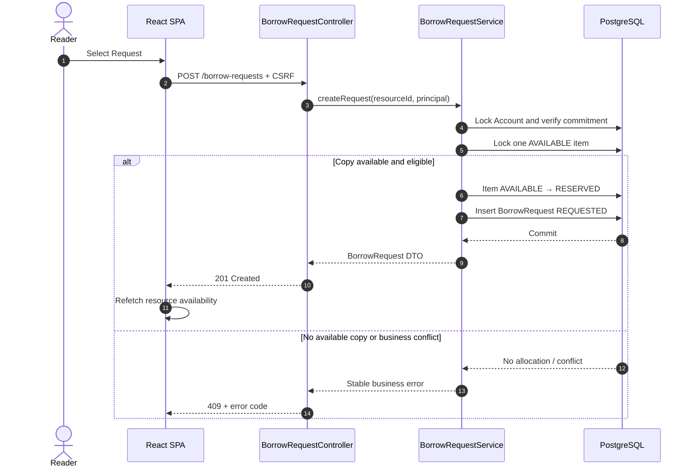
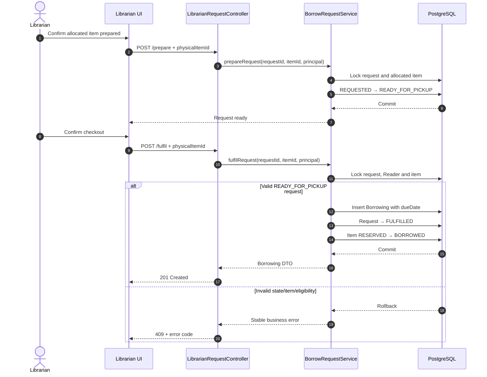

# Librio — Sprint 2 Borrow Request & Checkout Low-Level Design
**Project:** Librio | **Sprint:** Sprint 2 (20/08/2026–25/08/2026)  
**Design source:** T-082 | **Requirement:** T-081 & Sprint 2 SRS | **HLD:** [architecture.md](../hld/architecture.md) | **Authentication:** [sprint-2-auth-lld.md](./sprint-2-auth-lld.md)  
Flow: `Reader request → reserve physical item → librarian prepare → reader pickup → librarian fulfil/checkout → create Borrowing`  
Sprint 2 không triển khai FIFO waitlist, automatic item substitution, multi-branch, scanner/hardware, fine/payment blocking, membership/VIP, renewal hoặc production-scale distributed concurrency.

---

## 1. Domain Model & Request Lifecycle
### 1.1 BorrowRequest Entity
`BorrowRequest` biểu diễn yêu cầu mượn của Reader và reservation trên một physical copy. Request chưa phải là Borrowing.

| Field | Description | Rules |
| :--- | :--- | :--- |
| `id` | BigInt | Primary Key, immutable. |
| `readerId` | BigInt | Foreign Key → `Account.id`. |
| `resourceId` | BigInt | Foreign Key → `Resource.id`. |
| `physicalItemId` | BigInt | Foreign Key → exact allocated `PhysicalItem.id`; bắt buộc trong Sprint 2. |
| `status` | Enum | `REQUESTED`, `READY_FOR_PICKUP`, `FULFILLED`, `CANCELLED`, `REJECTED`, `EXPIRED`. |
| `requestedAt` | Timestamp | Server-generated khi tạo request. |
| `statusUpdatedAt` | Timestamp | Server-generated khi status thay đổi. |
| `expiresAt` | Timestamp | Request/pickup expiration do server policy tạo. |
| `preparedAt` / `preparedBy` | Timestamp / BigInt | Thời điểm và librarian thực hiện prepare. |
| `rejectedAt` / `rejectedBy` | Timestamp / BigInt | Thời điểm và librarian thực hiện reject. |
| `fulfilledAt` / `fulfilledBy` | Timestamp / BigInt | Thời điểm và librarian thực hiện checkout. |
| `createdAt` / `updatedAt` | Timestamp | Standard audit fields. |

Không hard-delete terminal request. Request được giữ lại để phục vụ history, evidence và My Library.

### 1.2 Borrowing Entity
`Borrowing` chỉ được tạo khi librarian fulfil một request `READY_FOR_PICKUP`.

| Field | Description | Rules |
| :--- | :--- | :--- |
| `id` | BigInt | Primary Key, immutable. |
| `readerId` | BigInt | Phải bằng `BorrowRequest.readerId`. |
| `physicalItemId` | BigInt | Phải bằng `BorrowRequest.physicalItemId`. |
| `borrowRequestId` | BigInt | Foreign Key, Unique; một request chỉ tạo tối đa một Borrowing. |
| `borrowedAt` | Timestamp | Server-generated lúc fulfil. |
| `dueDate` | Timestamp | Server-generated từ loan-period policy và được persist. |
| `createdAt` / `updatedAt` | Timestamp | Standard audit fields. |

Request `REQUESTED` hoặc `READY_FOR_PICKUP` chưa có Borrowing và chưa có due date.

### 1.3 PhysicalItem Status
Sprint 2 sử dụng tối thiểu ba physical-item status:

| Status | Meaning | Counted as Available |
| :--- | :--- | :---: |
| `AVAILABLE` | Copy có thể được allocate cho request mới. | Có |
| `RESERVED` | Copy đã được giữ cho một active BorrowRequest. | Không |
| `BORROWED` | Copy đã được checkout và thuộc active Borrowing. | Không |

Các transition hợp lệ:
```text
AVAILABLE → RESERVED     Create request
RESERVED → AVAILABLE     Cancel / Reject / Expire
RESERVED → BORROWED      Fulfil
```

### 1.4 Request State Transitions
| Current State | Action | Next State | Actor |
| :--- | :--- | :--- | :--- |
| `REQUESTED` | Prepare | `READY_FOR_PICKUP` | Librarian |
| `REQUESTED` | Cancel | `CANCELLED` | Request owner |
| `REQUESTED` | Reject | `REJECTED` | Librarian |
| `REQUESTED` | Expire | `EXPIRED` | System |
| `READY_FOR_PICKUP` | Cancel | `CANCELLED` | Request owner |
| `READY_FOR_PICKUP` | Reject | `REJECTED` | Librarian |
| `READY_FOR_PICKUP` | Expire | `EXPIRED` | System |
| `READY_FOR_PICKUP` | Fulfil | `FULFILLED` | Librarian |

`FULFILLED`, `CANCELLED`, `REJECTED` và `EXPIRED` là terminal states. Terminal request không được reopen hoặc transition lần hai.

### 1.5 Domain Invariants
- Reader identity lấy từ authenticated session; reader-facing operation không nhận `readerId`.
- Một Reader chỉ có tối đa một active request trên cùng Resource.
- Reader không được request Resource đang có active Borrowing của chính mình.
- Commitment bằng active Borrowings + `REQUESTED/READY_FOR_PICKUP` requests.
- Request chỉ được tạo nếu reserve ngay đúng một `AVAILABLE` PhysicalItem.
- Allocated PhysicalItem phải thuộc đúng Resource của BorrowRequest.
- Một PhysicalItem chỉ thuộc tối đa một active reservation.
- Một PhysicalItem chỉ có tối đa một active Borrowing.
- Một fulfilled BorrowRequest chỉ tạo tối đa một Borrowing.
- Cancel/reject/expire phải release đúng allocated item.
- Fulfil không được substitute sang item khác.
- Availability và due date đều do server quản lý.

---

## 2. Access Matrix & API Contracts
### 2.1 Access Control Matrix
| Endpoint Group | Method | Required Access | CSRF Protection |
| :--- | :--- | :--- | :--- |
| `/borrow-requests` | POST | `ROLE_READER` | Bắt buộc |
| `/me/borrow-requests` | GET | `ROLE_READER` | Không |
| `/me/borrow-requests/{id}/cancel` | POST | `ROLE_READER` | Bắt buộc |
| `/me/borrowings` | GET | `ROLE_READER` | Không |
| `/librarian/borrow-requests` | GET | `ROLE_LIBRARIAN` | Không |
| `/librarian/borrow-requests/{id}/prepare` | POST | `ROLE_LIBRARIAN` | Bắt buộc |
| `/librarian/borrow-requests/{id}/reject` | POST | `ROLE_LIBRARIAN` | Bắt buộc |
| `/librarian/borrow-requests/{id}/fulfil` | POST | `ROLE_LIBRARIAN` | Bắt buộc |

Authentication, session cookie, CSRF bootstrap và JSON security errors tuân theo [sprint-2-auth-lld.md](./sprint-2-auth-lld.md). API không dùng prefix `/api` và áp dụng deny-by-default.

### 2.2 Reader Endpoints
#### `POST /borrow-requests`
```json
{
  "resourceId": 10
}
```
Request không nhận `readerId`, `physicalItemId` hoặc `dueDate`.

Success: `201 Created`
```json
{
  "id": 1001,
  "status": "REQUESTED",
  "resource": {
    "id": 10,
    "title": "Clean Code",
    "authors": ["Robert C. Martin"]
  },
  "requestedAt": "2026-08-24T20:30:00+07:00",
  "statusUpdatedAt": "2026-08-24T20:30:00+07:00",
  "expiresAt": "2026-08-25T20:30:00+07:00"
}
```

#### `POST /me/borrow-requests/{requestId}/cancel`
Server query theo `requestId + authenticatedReaderId`. Không tồn tại hoặc không thuộc Reader hiện tại trả `404 REQUEST_NOT_FOUND`. Success trả `200 OK` với request status `CANCELLED`. Exact reserved item được release trong cùng transaction.

#### `GET /me/borrow-requests`
Trả active requests và tối đa năm terminal outcomes gần nhất.
```text
Active:
READY_FOR_PICKUP trước REQUESTED
→ expiresAt ASC NULLS LAST
→ requestedAt ASC
→ id ASC

Recent Outcomes:
statusUpdatedAt DESC
→ id ASC
→ LIMIT 5
```

#### `GET /me/borrowings`
Chỉ trả active Borrowings thuộc Reader hiện tại.
```text
dueDate ASC
→ borrowedAt ASC
→ id ASC
```
Empty collection trả `200 OK` với collection rỗng.

### 2.3 Librarian Endpoints
#### `GET /librarian/borrow-requests`
Trả request queue cần librarian xử lý. DTO được phép chứa allocated-item identity nhưng không chứa account credential hoặc internal security data.

#### `POST /librarian/borrow-requests/{requestId}/prepare`
```json
{
  "physicalItemId": 501
}
```
Chỉ request `REQUESTED` và chưa hết hạn được prepare. `physicalItemId` phải đúng allocated item.

Success:
```text
REQUESTED → READY_FOR_PICKUP
```
Server set `preparedAt`, `preparedBy`, `statusUpdatedAt` và reset `expiresAt` theo pickup policy.

#### `POST /librarian/borrow-requests/{requestId}/reject`
Không yêu cầu custom rejection reason trong Sprint 2. Chỉ `REQUESTED` hoặc `READY_FOR_PICKUP` được reject. Success chuyển request sang `REJECTED` và release exact reserved item trong cùng transaction.

#### `POST /librarian/borrow-requests/{requestId}/fulfil`
```json
{
  "physicalItemId": 501
}
```
Chỉ request `READY_FOR_PICKUP`, chưa hết hạn và có Reader còn eligible mới được fulfil.

Success: `201 Created`
```json
{
  "id": 2001,
  "borrowRequestId": 1001,
  "resource": {
    "id": 10,
    "title": "Clean Code",
    "authors": ["Robert C. Martin"]
  },
  "borrowedAt": "2026-08-25T09:00:00+07:00",
  "dueDate": "2026-09-08T09:00:00+07:00"
}
```

### 2.4 DTO Shapes
Reader-facing BorrowRequest DTO được phép chứa:
- `id`
- `status`
- Resource summary: `id`, `title`, `authors`
- `requestedAt`
- `statusUpdatedAt`
- `expiresAt`

Reader-facing DTO không expose:
- `readerId`
- `physicalItemId`
- Internal reservation metadata
- Librarian account data
- Account security data

Librarian DTO có thể bổ sung `physicalItemId`, item identifier và thông tin cần thiết để prepare/checkout.

### 2.5 Error Handling & Stable Error Codes
| HTTP Status | Error Code | Meaning |
| :--- | :--- | :--- |
| `401` | `AUTHENTICATION_REQUIRED` | Chưa có authenticated session. |
| `403` | `OPERATION_FORBIDDEN` | Account không có role phù hợp. |
| `403` | `CSRF_TOKEN_INVALID` | State-changing request thiếu/sai CSRF token. |
| `404` | `RESOURCE_NOT_FOUND` | Resource không tồn tại. |
| `404` | `REQUEST_NOT_FOUND` | Request không tồn tại hoặc không thuộc Reader hiện tại. |
| `409` | `NO_PHYSICAL_COPY` | Resource không có physical item. |
| `409` | `NO_AVAILABLE_COPY` | Không còn copy `AVAILABLE`. |
| `409` | `DUPLICATE_ACTIVE_REQUEST` | Reader đã có active request cùng Resource. |
| `409` | `ACTIVE_BORROWING_EXISTS` | Reader đang mượn cùng Resource. |
| `409` | `BORROWING_LIMIT_REACHED` | Reader đã đạt commitment limit. |
| `409` | `ITEM_MISMATCH` | Librarian xác nhận sai allocated item. |
| `409` | `INVALID_REQUEST_STATE` | Action không hợp lệ với request state hiện tại. |
| `409` | `REQUEST_NOT_CANCELLABLE` | Request không còn được phép cancel. |
| `409` | `REQUEST_EXPIRED` | Request đã quá `expiresAt`. |
| `409` | `READER_INELIGIBLE` | Reader không còn đủ điều kiện checkout. |
| `409` | `RESERVATION_CONFLICT` | Item không còn reserved đúng cho request. |

Frontend branch theo stable `code`, không parse `message`. Unexpected failure trả generic error và không lộ stack trace, SQL hoặc credential.

---

## 3. Borrow Request & Checkout Architecture
### 3.1 Create Request & Reserve Item
`BorrowRequestService.createRequest()` thực hiện trong một transaction:

1. Lấy current Account từ `SecurityContext`.
2. Lock Account row để serialize commitment evaluation.
3. Verify `ACTIVE + READER`.
4. Tìm Resource.
5. Verify Resource có physical item.
6. Verify không có active request cùng Resource.
7. Verify không có active Borrowing cùng Resource.
8. Tính commitment và kiểm tra configured limit.
9. Chọn một `AVAILABLE` PhysicalItem bằng PostgreSQL row locking.
10. Chuyển item `AVAILABLE → RESERVED`.
11. Tạo BorrowRequest `REQUESTED`.
12. Server tạo timestamps và `expiresAt`.
13. Commit.

Allocation query tương đương:
```sql
SELECT *
FROM physical_items
WHERE resource_id = :resourceId
  AND status = 'AVAILABLE'
ORDER BY id
FOR UPDATE SKIP LOCKED
LIMIT 1;
```
Nếu không lấy được copy, trả `409 NO_AVAILABLE_COPY`. Reserve item hoặc persist request thất bại làm rollback toàn bộ.

### 3.2 Prepare Request
`BorrowRequestService.prepareRequest()`:

1. Lock BorrowRequest.
2. Verify request `REQUESTED`.
3. Verify request chưa hết hạn.
4. Lock exact allocated PhysicalItem.
5. Verify body `physicalItemId` khớp allocated item.
6. Verify item vẫn `RESERVED`.
7. Request → `READY_FOR_PICKUP`.
8. Set `preparedAt`, `preparedBy`, `statusUpdatedAt`.
9. Reset `expiresAt` theo pickup policy.
10. Commit.

Prepare không tạo Borrowing hoặc due date.

### 3.3 Reader Cancel
`BorrowRequestService.cancelOwnRequest()` query request bằng `requestId + authenticatedReaderId`.

Trong transaction:

1. Lock BorrowRequest.
2. Verify `REQUESTED` hoặc `READY_FOR_PICKUP`.
3. Recheck `expiresAt`.
4. Lock exact allocated PhysicalItem.
5. Request → `CANCELLED`.
6. Item `RESERVED → AVAILABLE`.
7. Update `statusUpdatedAt`.
8. Commit.

Không hard-delete request. Sprint 2 không hỗ trợ idempotency key; cancel terminal request trả `409 REQUEST_NOT_CANCELLABLE`.

### 3.4 Librarian Reject
Trong một transaction:

1. Lock BorrowRequest.
2. Verify `REQUESTED` hoặc `READY_FOR_PICKUP`.
3. Recheck `expiresAt`.
4. Lock exact allocated PhysicalItem.
5. Request → `REJECTED`.
6. Item `RESERVED → AVAILABLE`.
7. Set `rejectedAt`, `rejectedBy`, `statusUpdatedAt`.
8. Commit.

Reject không tạo Borrowing.

### 3.5 Request Expiration
`BorrowRequestExpirationService` chạy scheduled theo configured scan interval.

Mỗi expired request được xử lý trong transaction:

1. Lock BorrowRequest.
2. Verify status vẫn là `REQUESTED` hoặc `READY_FOR_PICKUP`.
3. Verify `expiresAt <= Clock.instant()`.
4. Lock exact allocated PhysicalItem.
5. Request → `EXPIRED`.
6. Item `RESERVED → AVAILABLE`.
7. Update `statusUpdatedAt`.
8. Commit.

Prepare/cancel/reject/fulfil cũng recheck `expiresAt` dưới lock. Nếu request đã quá hạn, requested action không được tiếp tục; expiration transition phải được persist trước khi trả `409 REQUEST_EXPIRED`.

### 3.6 Fulfil Request & Create Borrowing
`BorrowRequestService.fulfilRequest()` thực hiện trong một transaction:

1. Lock BorrowRequest.
2. Verify request `READY_FOR_PICKUP`.
3. Verify request chưa hết hạn.
4. Lock Reader Account và verify `ACTIVE`.
5. Lock exact allocated PhysicalItem.
6. Verify body `physicalItemId` khớp allocated item.
7. Verify item vẫn `RESERVED` và thuộc request.
8. Verify request chưa có Borrowing.
9. Tạo đúng một Borrowing.
10. Server tạo `borrowedAt` và `dueDate`.
11. Request → `FULFILLED`.
12. Set `fulfilledAt`, `fulfilledBy`, `statusUpdatedAt`.
13. Item `RESERVED → BORROWED`.
14. Commit.

Client không được gửi hoặc override `dueDate`. Reload Borrowing đọc persisted due date, không tính lại.

### 3.7 Transaction Boundaries
| Operation | Atomic Changes |
| :--- | :--- |
| Create | Reserve item + create BorrowRequest |
| Cancel | Request `CANCELLED` + release item |
| Reject | Request `REJECTED` + release item |
| Expire | Request `EXPIRED` + release item |
| Prepare | Request `READY_FOR_PICKUP` + timestamps + pickup expiration |
| Fulfil | Create Borrowing + request `FULFILLED` + item `BORROWED` |

Business logic nằm ở Service layer. Controller chỉ validate request DTO, lấy authenticated principal, gọi Service và map result sang DTO/error response.

### 3.8 Concurrency & Locking
Lock order:
```text
Create:
Account → PhysicalItem

Prepare/Cancel/Reject/Expire:
BorrowRequest → PhysicalItem

Fulfil:
BorrowRequest → Account → PhysicalItem
```
Database constraint là lớp bảo vệ cuối cho active-request, active-reservation và request-to-borrowing uniqueness.

| Race | Required Outcome |
| :--- | :--- |
| Hai Reader tranh copy cuối | Chính xác một request thành công; request thua nhận `NO_AVAILABLE_COPY`. |
| Double-click cùng Reader/Resource | Một request thành công; request còn lại nhận `DUPLICATE_ACTIVE_REQUEST`. |
| Hai request khác Resource tranh commitment slot cuối | Một thành công; request còn lại nhận `BORROWING_LIMIT_REACHED`. |
| Hai librarian fulfil cùng request | Chỉ một Borrowing được tạo. |
| Cancel và fulfil cạnh tranh | Chỉ một terminal transition commit. |
| Expire và fulfil cạnh tranh | Request không thể vừa `EXPIRED` vừa tạo Borrowing. |

Không chỉ check state bằng Java rồi update không khóa. Constraint violation do race phải rollback và được map sang stable business error, không trả raw database exception.

---

## 4. Sequence Diagrams
### 4.1 Create Request & Reserve Item


### 4.2 Prepare & Fulfil Checkout


### 4.3 Cancel/Reject/Expire & Release Item
```mermaid
sequenceDiagram
    autonumber
    actor Actor as Reader/Librarian/Scheduler
    participant API as Controller/Scheduler
    participant SVC as BorrowRequestService
    participant DB as PostgreSQL
    Actor->>API: Cancel / Reject / Expire
    API->>SVC: Execute transition
    SVC->>DB: Lock BorrowRequest
    SVC->>DB: Validate state and expiresAt
    SVC->>DB: Lock exact allocated item
    alt Transition valid
        SVC->>DB: Request → terminal state
        SVC->>DB: Item RESERVED → AVAILABLE
        DB-->>SVC: Commit
        SVC-->>API: Updated outcome
    else Transition lost or invalid
        DB-->>SVC: Current committed state
        SVC-->>API: 409 stable error
    end
```

---

## 5. Circulation Policy & Runtime Configuration
### 5.1 Commitment Limit
Commitment được tính bằng:
```text
Active Borrowings
+ REQUESTED requests
+ READY_FOR_PICKUP requests
```
Terminal requests và returned Borrowings không tính vào commitment. Account row được lock trước khi count để hai competing requests của cùng Reader không cùng vượt limit.

Configuration:
```yaml
librio:
  circulation:
    commitment-limit: ${LIBRIO_COMMITMENT_LIMIT}
```
Giá trị phải được chốt trước T-084/T-087 và không hard-code trong Controller.

### 5.2 Request & Pickup Expiration
```yaml
librio:
  circulation:
    request-expiration: ${LIBRIO_REQUEST_EXPIRATION}
    pickup-expiration: ${LIBRIO_PICKUP_EXPIRATION}
```
- Request mới nhận `expiresAt = serverTime + request-expiration`.
- Khi prepare, `expiresAt` được reset thành `serverTime + pickup-expiration`.
- Expiration deadline không phải borrowing due date.

### 5.3 Loan Period & Due Date
```yaml
librio:
  circulation:
    loan-period: ${LIBRIO_LOAN_PERIOD}
```
`dueDate` chỉ được tạo khi fulfil:
```text
dueDate = borrowedAt + configured loan-period
```
`borrowedAt` và `dueDate` phải được persist. Client không được override và reload không tính lại due date.

### 5.4 Expiration Scheduler
```yaml
librio:
  circulation:
    expiration-scan-interval: ${LIBRIO_EXPIRATION_SCAN_INTERVAL}
```
Scheduler chạy trong backend application, tìm active requests quá hạn và gọi expiration service. Scheduler không update database ngoài Service transaction và phải sử dụng cùng locking/state rules với các operation khác.

### 5.5 Persistence & Restart Behavior
- BorrowRequest, reservation state, Borrowing và due date đều persist trong PostgreSQL.
- Browser refresh hoặc frontend restart không làm mất state.
- Backend restart không làm mất circulation data.
- Sau backend restart, expiration scheduler tiếp tục xử lý request đã quá hạn.
- Availability luôn được derive từ persisted PhysicalItem state.
- Digital availability không bị ảnh hưởng bởi physical request lifecycle.
- Sprint 2 đánh giá transactional correctness trong một Spring Boot instance và PostgreSQL environment; không cam kết distributed locking, production SLA hoặc multi-instance throughput.