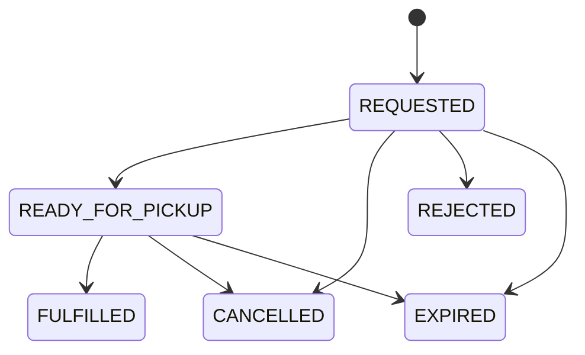

# Librio — Software Requirements Specification — Sprint 2

**Project:** Librio
**Sprint:** Sprint 2 — 20/08/2026–25/08/2026
**Related analysis:** T-071, T-081, T-091
**Related design:** T-072, T-082, T-092, T-093

---

## 1. Purpose and Scope

### 1.1 Purpose

Tài liệu này mở rộng Sprint 1 SRS baseline với các yêu cầu được thêm hoặc thay đổi trong Sprint 2.

Các yêu cầu `LIB-01` đến `LIB-06` của Sprint 1 vẫn giữ nguyên, trừ khi tài liệu này ghi rõ thay đổi.

Sprint 2 bổ sung reader identity, authentication và physical circulation workflow:

```text
Login
  → Submit Borrow Request
  → Library Prepares Item
  → Checkout
  → View My Requests / My Borrowings
```

### 1.2 In scope

Sprint 2 bao gồm:

* Account-backed reader identity.
* Login, logout và khôi phục authenticated session.
* Phân quyền `READER` và `LIBRARIAN`.
* Reader gửi yêu cầu mượn physical resource.
* Hệ thống phân bổ một physical item khả dụng cho request.
* Librarian chuẩn bị, từ chối hoặc fulfil request.
* Checkout tạo active borrowing và due date.
* Reader xem active requests, recent request outcomes và active borrowings.
* Reader hủy request đang active.
* Availability phản ánh item đã được reserve hoặc checkout.
* Security, ownership và transactional consistency cho các operation trên.

### 1.3 Out of scope and deferred

Các nội dung sau chưa thuộc Sprint 2:

* Self-registration.
* Email verification.
* Password reset hoặc password change.
* Single Sign-On và social login.
* Login rate limiting.
* Account-management UI và chức năng disable account.
* Tự động revoke session đã tồn tại khi account chuyển sang `DISABLED`.
* FIFO waitlist hoặc hold queue khi không còn bản khả dụng.
* Thay physical item đã được phân bổ bằng một item khác.
* Return và renew.
* Completed borrowing history.
* Overdue và due-soon calculation.
* Fine, payment, subscription hoặc membership restriction.
* Custom rejection hoặc cancellation reason.
* Multiple branches và pickup locations.
* Notification, polling, WebSocket hoặc push update.
* Persistent offline circulation cache.

---

## 2. Actors and Use Cases

### 2.1 Actors

| Actor         | Description                          | Permitted scope                                                      |
| ------------- | ------------------------------------ | -------------------------------------------------------------------- |
| **Guest**     | Người chưa đăng nhập                 | Browse, search, xem resource detail và availability                  |
| **Reader**    | `ACTIVE` account có role `READER`    | Gửi và hủy borrow request; xem requests và borrowings của chính mình |
| **Librarian** | `ACTIVE` account có role `LIBRARIAN` | Chuẩn bị, từ chối và fulfil borrow request                           |

Trong Sprint 2, `Account` có role `READER` chính là reader identity. Hệ thống chưa tách `ReaderProfile`.

Backend phải lấy current account từ authenticated session. Reader-facing operation không được sử dụng `readerId` do client tự chọn.

### 2.2 Use cases

| ID         | Use case                  | Primary actor    | Main outcome                                                      |
| ---------- | ------------------------- | ---------------- | ----------------------------------------------------------------- |
| `UC-S2-01` | Authenticate account      | Reader/Librarian | Tạo authenticated session cho `ACTIVE` account                    |
| `UC-S2-02` | Submit borrow request     | Reader           | Tạo request và reserve một physical item khả dụng                 |
| `UC-S2-03` | Prepare or reject request | Librarian        | Request được chuẩn bị để pickup hoặc chuyển sang terminal outcome |
| `UC-S2-04` | Fulfil request            | Librarian        | Tạo borrowing cho exact reserved item và xác định due date        |
| `UC-S2-05` | View My Library           | Reader           | Xem requests và active borrowings thuộc current account           |
| `UC-S2-06` | Cancel borrow request     | Reader           | Hủy active request và giải phóng exact reserved item              |

---

## 3. Functional Requirements

### 3.1 Account and Authentication

#### `AUTH-01` — Public discovery

Guest phải có thể sử dụng các chức năng discovery mà không cần đăng nhập, bao gồm:

* Browse resources.
* Search resources.
* View resource detail.
* View availability.

#### `AUTH-02` — Protected reader operations

Borrow request, request cancellation và personal circulation data phải yêu cầu authenticated account có reader access.

#### `AUTH-03` — Protected librarian operations

Các operation prepare, reject và fulfil request phải yêu cầu authenticated account có role `LIBRARIAN`.

#### `AUTH-04` — Login

Hệ thống phải cho phép `ACTIVE` account đăng nhập bằng canonical email và password hợp lệ.

Login thành công phải tạo authenticated server-side session và trả safe account summary.

#### `AUTH-05` — Generic login failure

Email không tồn tại, password không đúng và account `DISABLED` phải nhận cùng một generic login failure.

Response không được giúp client xác định account có tồn tại hay không.

#### `AUTH-06` — Session restoration

Frontend phải có thể khôi phục trạng thái đăng nhập từ server sau khi reload ứng dụng.

#### `AUTH-07` — Logout

Logout phải hủy authenticated session phía server và làm session cookie hiện tại hết hiệu lực.

Chỉ xóa cookie hoặc state phía client không được xem là logout hoàn chỉnh.

#### `AUTH-08` — Current account

Authenticated client phải có thể lấy safe summary của current account.

Safe summary không được chứa password hash, session credential hoặc dữ liệu nhạy cảm khác.

#### `AUTH-09` — Disabled account

Account có status `DISABLED` không được tạo authenticated session mới, kể cả khi password đúng.

Sprint 2 chưa yêu cầu tự động hủy session đã tồn tại trước khi account bị disable.

#### `AUTH-10` — Current-reader identity

Backend phải xác định reader đang thao tác từ authenticated account ID.

Client không được gửi `readerId` để thực hiện operation thay một reader khác.

#### `AUTH-11` — No automatic circulation action

Login thành công không được tự động tạo borrow request hoặc borrowing. Sau login, reader phải chủ động thực hiện operation tương ứng.

---

### 3.2 Borrow Request and Checkout

#### `BOR-01` — Submit request

Authenticated active reader phải có thể gửi borrow request cho một resource có ít nhất một physical item khả dụng.

#### `BOR-02` — Immediate item allocation

Khi request được tạo thành công, hệ thống phải phân bổ một exact physical item đang `AVAILABLE` và chuyển item đó sang `RESERVED`.

#### `BOR-03` — No availability

Nếu không còn physical item khả dụng tại thời điểm commit, hệ thống không được tạo request và không được thay đổi item state.

Sprint 2 không tạo waitlist trong trường hợp này.

#### `BOR-04` — Duplicate prevention

Reader không được tạo thêm active request cho một resource nếu reader đã có:

* Active request cho resource đó; hoặc
* Active borrowing cho resource đó.

#### `BOR-05` — Active commitment limit

Hệ thống phải kiểm tra server-defined active commitment limit trước khi tạo request.

Giá trị cụ thể và cách cấu hình limit được xác định trong Sprint 2 technical design.

#### `BOR-06` — Initial request state

Request mới được tạo thành công phải có status `REQUESTED`.

#### `BOR-07` — Prepare request

Librarian phải có thể chuyển request hợp lệ từ `REQUESTED` sang `READY_FOR_PICKUP`.

Exact physical item đã phân bổ phải tiếp tục được giữ ở trạng thái `RESERVED`.

#### `BOR-08` — Reject or expire request

Request không thể tiếp tục phải có thể chuyển sang `REJECTED` hoặc `EXPIRED` theo operation hoặc policy tương ứng.

Khi request kết thúc mà chưa checkout, exact reserved item phải được giải phóng về `AVAILABLE`.

#### `BOR-09` — Exact-item fulfilment

Librarian chỉ được fulfil request bằng exact physical item đã được phân bổ cho request đó.

Sprint 2 không cho phép tự động hoặc thủ công thay thế bằng một physical item khác trong lúc fulfil.

#### `BOR-10` — Checkout

Fulfil request thành công phải:

1. Chuyển request sang `FULFILLED`.
2. Tạo một active borrowing cho authenticated reader của request.
3. Liên kết borrowing với exact reserved physical item.
4. Chuyển item từ `RESERVED` sang `BORROWED`.
5. Ghi thời điểm checkout và due date theo server policy.

#### `BOR-11` — Atomic fulfilment

Các thay đổi thuộc checkout phải được commit atomically.

Hệ thống không được để lại trạng thái một phần như:

* Request đã `FULFILLED` nhưng không có borrowing.
* Borrowing đã tồn tại nhưng item vẫn `RESERVED`.
* Item đã `BORROWED` nhưng request chưa fulfil.

#### `BOR-12` — One active borrowing per item

Một physical item chỉ được có tối đa một active borrowing tại cùng thời điểm.

#### `BOR-13` — Due date creation

Due date chỉ được tạo khi checkout thành công, không phải khi reader gửi request.

Loan duration cụ thể được xác định bằng server policy trong technical design.

#### `BOR-14` — Availability consistency

Physical item ở trạng thái `RESERVED` hoặc `BORROWED` không được tính là available.

Availability hiển thị cho reader phải phản ánh trạng thái đã commit trên server.

#### `BOR-15` — Concurrent request handling

Nếu nhiều reader cùng request bản khả dụng cuối cùng, chỉ một request được phép phân bổ item và commit thành công.

Các request thua race phải thất bại mà không tạo partial data.

#### `BOR-16` — Concurrent terminal operations

Nếu hai operation cạnh tranh để kết thúc cùng một request, chỉ một valid transition được commit.

Operation còn lại phải nhận conflict response và không được ghi đè kết quả đã commit.

---

### 3.3 My Requests and My Borrowings

#### `MYL-01` — My Library page

Authenticated reader phải có một account area tại `/my-library` gồm hai section:

* My Requests.
* My Borrowings.

Hai section phải luôn có vị trí hiển thị riêng, kể cả khi một collection đang rỗng hoặc tải thất bại.

#### `MYL-02` — Active requests

My Requests phải hiển thị active requests có status:

* `REQUESTED`.
* `READY_FOR_PICKUP`.

#### `MYL-03` — Recent outcomes

My Requests phải hiển thị tối đa năm terminal request gần nhất có status:

* `FULFILLED`.
* `CANCELLED`.
* `REJECTED`.
* `EXPIRED`.

Full request history chưa thuộc Sprint 2.

#### `MYL-04` — Active borrowings

My Borrowings chỉ hiển thị borrowings chưa hoàn thành hoặc chưa return.

Completed borrowing history chưa thuộc Sprint 2.

#### `MYL-05` — Request and borrowing distinction

Một fulfilled request có thể xuất hiện trong Recent Outcomes đồng thời với active borrowing tương ứng.

Hai record có ý nghĩa khác nhau:

* Request record giải thích kết quả của yêu cầu.
* Borrowing record thể hiện nghĩa vụ trả sách hiện tại.

#### `MYL-06` — Reader ownership

Reader chỉ được nhận request và borrowing thuộc authenticated account ID.

Reader-facing response không được chứa `readerId`.

#### `MYL-07` — Bounded display data

My Library phải cung cấp đủ dữ liệu để hiển thị:

* Resource ID.
* Resource title.
* Authors.
* Request status.
* Relevant request timestamps.
* Borrowed time.
* Due date.

Response không được làm lộ raw domain graph, password/account credential, internal reservation field hoặc physical-item identifier không cần thiết cho reader UI.

#### `MYL-08` — Empty collections

Không có request hoặc borrowing phải được xem là một collection rỗng hợp lệ, không phải resource-not-found error.

#### `MYL-09` — Urgency-first ordering

Hệ thống phải trả My Library data theo deterministic urgency-first ordering:

* `READY_FOR_PICKUP` trước `REQUESTED`.
* Active request sắp hết hạn trước.
* Recent outcome mới nhất trước.
* Active borrowing có due date gần nhất trước.

Frontend không được tự áp dụng một thứ tự nghiệp vụ khác.

#### `MYL-10` — Independent section loading

My Requests và My Borrowings phải được tải và xử lý độc lập.

Một section thất bại không được che dữ liệu đã tải thành công của section còn lại.

#### `MYL-11` — Section retry

Reader phải có thể retry riêng section tải thất bại mà không bắt buộc reload toàn bộ trang.

#### `MYL-12` — Server revalidation

Browser refresh phải lấy lại circulation data từ server.

Circulation data không được phụ thuộc vào bản cache lâu dài phía client để xác định trạng thái hiện tại.

---

### 3.4 Request Cancellation

#### `CAN-01` — Cancellable states

Reader phải có thể cancel request của chính mình khi request đang ở một trong hai trạng thái:

* `REQUESTED`.
* `READY_FOR_PICKUP`.

#### `CAN-02` — Terminal requests

Request ở trạng thái `FULFILLED`, `CANCELLED`, `REJECTED` hoặc `EXPIRED` không được cancel.

#### `CAN-03` — Confirmation

Frontend phải yêu cầu reader xác nhận trước khi gửi cancel operation.

Nội dung confirmation phải cho reader biết reserved item sẽ được giải phóng cho reader khác.

#### `CAN-04` — Atomic cancellation

Cancel thành công phải atomically:

1. Xác nhận request thuộc authenticated reader.
2. Xác nhận request vẫn cancellable.
3. Chuyển request sang `CANCELLED`.
4. Chuyển exact reserved item từ `RESERVED` về `AVAILABLE`.
5. Cập nhật thời điểm thay đổi trạng thái.

#### `CAN-05` — Preserve request history

Cancel không được xóa request record.

Cancelled request có thể xuất hiện trong Recent Outcomes.

#### `CAN-06` — Ownership-safe lookup

Request không tồn tại và request thuộc reader khác phải có cùng observable not-found result.

Hệ thống không được tiết lộ sự tồn tại của request thuộc account khác.

#### `CAN-07` — Cancel/fulfil race

Nếu cancel cạnh tranh với librarian fulfil, chỉ một operation được commit.

Nếu fulfil thắng race, client phải có thể refresh cả request và borrowing data để phản ánh trạng thái mới.

#### `CAN-08` — Post-cancel refresh

Sau khi cancel thành công, client phải refresh My Requests để hiển thị kết quả đã được server commit.

Không bắt buộc refresh My Borrowings nếu không có concurrent fulfil conflict.

---

## 4. Business Rules

### 4.1 Account and Ownership Rules

| ID       | Business rule                                                                                                 |
| -------- | ------------------------------------------------------------------------------------------------------------- |
| `BR-A01` | Sprint 2 dùng `Account` có role `READER` làm reader identity; chưa tách `ReaderProfile`.                      |
| `BR-A02` | Account ID là immutable identity dùng để liên kết borrow request và borrowing.                                |
| `BR-A03` | Email phải được trim, chuyển lowercase và enforce uniqueness trước khi lưu hoặc tìm kiếm.                     |
| `BR-A04` | Không áp dụng Gmail-specific normalization như bỏ dấu `.` hoặc `+tag`.                                        |
| `BR-A05` | Account có một role trong phạm vi Sprint 2: `READER` hoặc `LIBRARIAN`.                                        |
| `BR-A06` | Account status trong Sprint 2 gồm `ACTIVE` và `DISABLED`.                                                     |
| `BR-A07` | Chỉ `ACTIVE` account được tạo authenticated session mới.                                                      |
| `BR-A08` | Borrow request và borrowing phải tham chiếu authenticated account ID, không dùng identity do client cung cấp. |

### 4.2 Borrow Request Lifecycle

Request sử dụng các trạng thái:

```text
Active:
REQUESTED
READY_FOR_PICKUP

Terminal:
FULFILLED
CANCELLED
REJECTED
EXPIRED
```

Các transition chính:



| ID       | Business rule                                                                                |
| -------- | -------------------------------------------------------------------------------------------- |
| `BR-R01` | Request terminal không được quay lại active state.                                           |
| `BR-R02` | `FULFILLED` chỉ được tạo bởi checkout thành công.                                            |
| `BR-R03` | `CANCELLED`, `REJECTED` và `EXPIRED` phải giải phóng reserved item nếu checkout chưa xảy ra. |
| `BR-R04` | Request record được giữ lại sau terminal transition.                                         |
| `BR-R05` | Reader cancel được cả `REQUESTED` và `READY_FOR_PICKUP`.                                     |

### 4.3 Availability and Checkout Rules

Physical item trong phạm vi Sprint 2 sử dụng tối thiểu các circulation state:

```text
AVAILABLE
RESERVED
BORROWED
```

| ID       | Business rule                                                                       |
| -------- | ----------------------------------------------------------------------------------- |
| `BR-I01` | Chỉ item `AVAILABLE` được phân bổ cho request mới.                                  |
| `BR-I02` | Request thành công phải giữ một exact item ở trạng thái `RESERVED`.                 |
| `BR-I03` | Item `RESERVED` và `BORROWED` không được tính vào available copies.                 |
| `BR-I04` | Fulfil chuyển exact item `RESERVED → BORROWED`.                                     |
| `BR-I05` | Cancel, reject hoặc expire trước checkout chuyển exact item `RESERVED → AVAILABLE`. |
| `BR-I06` | Không có physical-item substitution trong Sprint 2.                                 |
| `BR-I07` | Due date được tính từ thời điểm checkout theo server policy.                        |
| `BR-I08` | Overdue và return lifecycle chưa được xử lý trong Sprint 2.                         |

### 4.4 Collection and Ordering Rules

| ID       | Business rule                                                                      |
| -------- | ---------------------------------------------------------------------------------- |
| `BR-M01` | Active Requests chỉ chứa `REQUESTED` và `READY_FOR_PICKUP`.                        |
| `BR-M02` | Recent Outcomes chỉ chứa terminal requests và có tối đa năm record.                |
| `BR-M03` | My Borrowings chỉ chứa active borrowings.                                          |
| `BR-M04` | Empty collection trả thành công với collection rỗng.                               |
| `BR-M05` | Backend là nguồn quyết định ordering; frontend không sort lại theo business logic. |
| `BR-M06` | Ordering phải có deterministic tie-breaker để cùng dữ liệu cho cùng thứ tự.        |
| `BR-M07` | Timestamp trao đổi giữa backend và frontend dùng ISO 8601 có offset.               |
| `BR-M08` | Frontend hiển thị timestamp theo timezone `Asia/Ho_Chi_Minh`.                      |

---

## 5. Non-functional and Security Requirements

### 5.1 Authentication and session security

| ID       | Requirement                                                                                                 |
| -------- | ----------------------------------------------------------------------------------------------------------- |
| `SEC-01` | Password chỉ được lưu dưới dạng adaptive one-way hash; không lưu hoặc log plaintext password.               |
| `SEC-02` | Session credential phải được bảo vệ bằng `HttpOnly` cookie và không được frontend JavaScript đọc trực tiếp. |
| `SEC-03` | Production session cookie phải được truyền qua secure connection.                                           |
| `SEC-04` | State-changing request phải được CSRF protection.                                                           |
| `SEC-05` | Frontend phải lấy CSRF token mới sau login hoặc logout khi session context thay đổi.                        |
| `SEC-06` | Login thành công phải áp dụng session-fixation protection.                                                  |
| `SEC-07` | Logout phải invalidate server-side session.                                                                 |

### 5.2 Authorization and privacy

| ID       | Requirement                                                                                     |
| -------- | ----------------------------------------------------------------------------------------------- |
| `SEC-08` | Protected operation chưa authentication phải trả HTTP `401`.                                    |
| `SEC-09` | Authenticated account không có required role phải trả HTTP `403`.                               |
| `SEC-10` | Reader-facing repository query phải enforce ownership bằng authenticated account ID.            |
| `SEC-11` | Not-owned request phải có cùng observable result với nonexistent request.                       |
| `SEC-12` | Error response không được chứa password, session credential, stack trace hoặc dữ liệu nhạy cảm. |
| `SEC-13` | Authentication failure không được tiết lộ account có tồn tại hay không.                         |

### 5.3 Consistency and concurrency

| ID       | Requirement                                                                        |
| -------- | ---------------------------------------------------------------------------------- |
| `NFR-01` | Request allocation, fulfilment và cancellation phải giữ transactional consistency. |
| `NFR-02` | Concurrent operation trên cùng item hoặc request phải có one-winner behavior.      |
| `NFR-03` | Operation thất bại không được để lại partial request, borrowing hoặc item state.   |
| `NFR-04` | Availability phải được tính từ server-side committed state.                        |
| `NFR-05` | Business-list ordering phải deterministic.                                         |

### 5.4 Client state and recoverability

| ID       | Requirement                                                                                                     |
| -------- | --------------------------------------------------------------------------------------------------------------- |
| `NFR-06` | My Requests và My Borrowings phải có loading, success và error state độc lập.                                   |
| `NFR-07` | Revalidation không được xóa last successful in-memory data trước khi request mới hoàn thành.                    |
| `NFR-08` | Khi authenticated session hết hạn, client phải xóa circulation state đang giữ trước khi chuyển sang login flow. |
| `NFR-09` | Circulation data không được persist vào `localStorage`.                                                         |
| `NFR-10` | Sprint 2 không yêu cầu polling, WebSocket hoặc realtime update.                                                 |

### 5.5 Failure semantics

| Condition                                | Required HTTP semantics                                     |
| ---------------------------------------- | ----------------------------------------------------------- |
| Protected operation nhưng chưa đăng nhập | `401 Unauthorized`                                          |
| Đã đăng nhập nhưng thiếu required role   | `403 Forbidden`                                             |
| Validation failure                       | `400 Bad Request`                                           |
| Resource hoặc request không tồn tại      | `404 Not Found`                                             |
| Request thuộc reader khác                | Cùng `404 Not Found` như nonexistent request                |
| Business state conflict                  | `409 Conflict`                                              |
| Unexpected server failure                | `500 Internal Server Error` và không làm lộ internal detail |

Exact error-code vocabulary và JSON error shape được định nghĩa thống nhất trong Sprint 2 API contract.

---

## 6. Traceability and Deferred Scope

### 6.1 Traceability matrix

| Story   | Use cases                          | Requirement groups                     | Analysis source | Technical design |
| ------- | ---------------------------------- | -------------------------------------- | --------------- | ---------------- |
| `US-07` | `UC-S2-01`                         | `AUTH-*`, `BR-A*`, `SEC-*`             | T-071           | T-072            |
| `US-08` | `UC-S2-02`, `UC-S2-03`, `UC-S2-04` | `BOR-*`, `BR-R*`, `BR-I*`, `NFR-01–05` | T-081           | T-082            |
| `US-09` | `UC-S2-05`, `UC-S2-06`             | `MYL-*`, `CAN-*`, `BR-M*`, `NFR-06–10` | T-091           | T-092, T-093     |

Các ma trận nghiệm thu (acceptance matrix) chi tiết được duy trì trong hồ sơ phân tích tương ứng:

* T-071: Điều kiện nghiệm thu cho account, authentication và authorization.
* T-081: `AC-081-01–AC-081-70`.
* T-091: `AC-091-01–AC-091-42`.

Các ma trận này là đầu vào cho technical design, triển khai (implementation) và QA của Sprint 2.

### 6.2 Deferred scope summary

| Area               | Deferred capability                                                  |
| ------------------ | -------------------------------------------------------------------- |
| Account            | Đăng ký, xác minh, khôi phục mật khẩu, UI quản lý tài khoản          |
| Authentication     | Rate limiting, SSO, lưu trữ session trên nhiều instance              |
| Circulation        | Waitlist, đổi bản sao, gia hạn (renew), trả sách và lịch sử hoàn tất |
| Policy             | Quy tắc quá hạn, tiền phạt, thanh toán, membership và đình chỉ       |
| Library operations | Nhiều chi nhánh, địa điểm nhận sách và tích hợp phần cứng            |
| Communication      | Email/push notification, polling, WebSocket và realtime updates     |
| Reader UI          | Phân trang, sắp xếp tùy chỉnh và persistent offline cache            |

### 6.3 Sprint 2 change summary

| Area                 | Sprint 1 baseline                             | Sprint 2 addition                                              |
| -------------------- | ---------------------------------------------- | ----------------------------------------------------------------- |
| Identity             | Reader là tác nhân khám phá chưa được xác thực | Reader identity được định danh dựa trên `Account` đã xác thực     |
| Access control       | API khám phá (discovery) là public             | Discovery giữ nguyên public; các thao tác circulation được bảo vệ |
| Availability         | Tính từ dữ liệu bản sao vật lý/kỹ thuật số     | Các bản sao đã reserve và mượn được loại khỏi availability        |
| Circulation          | Mượn sách nằm ngoài phạm vi thực hiện          | Xác định rõ vòng đời request, reservation và checkout             |
| Reader account area  | Chưa hỗ trợ                                    | Reader có thể xem danh sách request và active borrowings          |
| Request cancellation | Chưa hỗ trợ                                    | Reader có thể hủy active request và giải phóng reserved item      |

---