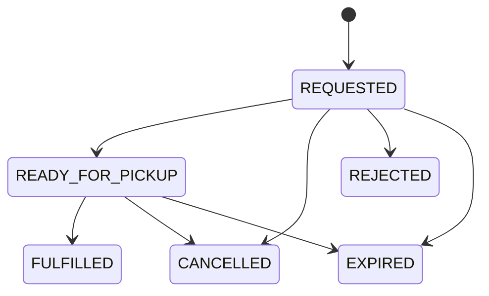

# Librio — Software Requirements Specification — Sprint 2

**Project:** Librio
**Sprint:** Sprint 2 — 20/08/2026–25/08/2026
**Related analysis:** T-071, T-081, T-091
**Related design:** T-072, T-082, T-091 lightweight design

---

## 1. Purpose and Scope

### 1.1 Purpose

Tài liệu này mở rộng Sprint 1 SRS baseline với các yêu cầu được thêm hoặc thay đổi trong Sprint 2.

Các yêu cầu `LIB-01` đến `LIB-06` của Sprint 1 vẫn giữ nguyên, trừ khi tài liệu này ghi rõ thay đổi.

Sprint 2 bổ sung reader identity, authentication và physical circulation workflow:

```text
Login
  → Submit Borrow Request
  → Library Prepares Item
  → Checkout
  → View My Requests / My Borrowings
```

### 1.2 In scope

Sprint 2 bao gồm:

* Account-backed reader identity.
* Login, logout và khôi phục authenticated session.
* Phân quyền `READER` và `LIBRARIAN`.
* Reader gửi yêu cầu mượn physical resource.
* Hệ thống phân bổ một physical item khả dụng cho request.
* Librarian chuẩn bị, từ chối hoặc fulfil request.
* Checkout tạo active borrowing và due date.
* Reader xem active requests, recent request outcomes và active borrowings.
* Reader hủy request đang active.
* Availability phản ánh item đã được reserve hoặc checkout.
* Security, ownership và transactional consistency cho các operation trên.

### 1.3 Out of scope and deferred

Các nội dung sau chưa thuộc Sprint 2:

* Self-registration.
* Email verification.
* Password reset hoặc password change.
* Single Sign-On và social login.
* Login rate limiting.
* Account-management UI và chức năng disable account.
* Tự động revoke session đã tồn tại khi account chuyển sang `DISABLED`.
* FIFO waitlist hoặc hold queue khi không còn bản khả dụng.
* Thay physical item đã được phân bổ bằng một item khác.
* Return và renew.
* Completed borrowing history.
* Overdue và due-soon calculation.
* Fine, payment, subscription hoặc membership restriction.
* Custom rejection hoặc cancellation reason.
* Multiple branches và pickup locations.
* Notification, polling, WebSocket hoặc push update.
* Persistent offline circulation cache.

---

## 2. Actors and Use Cases

### 2.1 Actors

| Actor         | Description                          | Permitted scope                                                      |
| ------------- | ------------------------------------ | -------------------------------------------------------------------- |
| **Guest**     | Người chưa đăng nhập                 | Browse, search, xem resource detail và availability                  |
| **Reader**    | `ACTIVE` account có role `READER`    | Gửi và hủy borrow request; xem requests và borrowings của chính mình |
| **Librarian** | `ACTIVE` account có role `LIBRARIAN` | Chuẩn bị, từ chối và fulfil borrow request                           |

Trong Sprint 2, `Account` có role `READER` chính là reader identity. Hệ thống chưa tách `ReaderProfile`.

Backend phải lấy current account từ authenticated session. Reader-facing operation không được sử dụng `readerId` do client tự chọn.

### 2.2 Use cases

| ID         | Use case                  | Primary actor    | Main outcome                                                      |
| ---------- | ------------------------- | ---------------- | ----------------------------------------------------------------- |
| `UC-S2-01` | Authenticate account      | Reader/Librarian | Tạo authenticated session cho `ACTIVE` account                    |
| `UC-S2-02` | Submit borrow request     | Reader           | Tạo request và reserve một physical item khả dụng                 |
| `UC-S2-03` | Prepare or reject request | Librarian        | Request được chuẩn bị để pickup hoặc chuyển sang terminal outcome |
| `UC-S2-04` | Fulfil request            | Librarian        | Tạo borrowing cho exact reserved item và xác định due date        |
| `UC-S2-05` | View My Library           | Reader           | Xem requests và active borrowings thuộc current account           |
| `UC-S2-06` | Cancel borrow request     | Reader           | Hủy active request và giải phóng exact reserved item              |

---

## 3. Detailed Functional Requirements

### 3.1 AUTH-01 — Account Authentication

* **Requirement:** Hệ thống phải cho phép `ACTIVE` account đăng nhập bằng canonical email và password hợp lệ, duy trì authenticated server-side session và đăng xuất an toàn.
* **Objective:** Cung cấp danh tính ổn định cho các chức năng circulation mà không làm mất khả năng truy cập public discovery của Guest.
* **Acceptance Criteria:**
  * `AC-AUTH-01` Guest vẫn sử dụng được browse, search, resource detail và availability mà không cần đăng nhập.
  * `AC-AUTH-02` `ACTIVE` account đăng nhập thành công bằng canonical email và password hợp lệ.
  * `AC-AUTH-03` Login thành công tạo authenticated server-side session.
  * `AC-AUTH-04` Login thành công trả safe account summary gồm ID, email, display name, role và account status.
  * `AC-AUTH-05` Safe account summary không chứa password hash, session credential hoặc dữ liệu nhạy cảm khác.
  * `AC-AUTH-06` Frontend khôi phục được current-account state từ server sau khi reload.
  * `AC-AUTH-07` Logout invalidate authenticated session phía server và làm session cookie hiện tại hết hiệu lực.
  * `AC-AUTH-08` Chỉ xóa cookie hoặc frontend state không được xem là logout hoàn chỉnh.
  * `AC-AUTH-09` Email không tồn tại, password sai và account `DISABLED` nhận cùng generic login failure.
  * `AC-AUTH-10` Authentication failure không giúp client xác định account có tồn tại hay không.
  * `AC-AUTH-11` Account `DISABLED` không tạo được authenticated session mới.
  * `AC-AUTH-12` Login thành công không tự động tạo borrow request hoặc borrowing.
* **Related Business Rules:** `BR-A03–BR-A07`
* **Related Security Requirements:** `SEC-01–SEC-07`, `SEC-12–SEC-13`

### 3.2 AUTH-02 — Protected Access and Reader Identity

* **Requirement:** Hệ thống phải bảo vệ circulation operation bằng authenticated account, role và ownership; backend phải xác định current reader từ authenticated session.
* **Objective:** Ngăn client tự chọn reader identity hoặc truy cập dữ liệu và operation ngoài quyền hạn.
* **Acceptance Criteria:**
  * `AC-ACCESS-01` Borrow request, request cancellation và personal circulation data yêu cầu authenticated account có reader access.
  * `AC-ACCESS-02` Prepare, reject, expire và fulfil request yêu cầu authenticated account có role `LIBRARIAN`.
  * `AC-ACCESS-03` Protected operation chưa đăng nhập trả HTTP `401`.
  * `AC-ACCESS-04` Account đã đăng nhập nhưng thiếu required role nhận HTTP `403`.
  * `AC-ACCESS-05` Backend lấy current Account ID từ authenticated principal.
  * `AC-ACCESS-06` Reader-facing operation không nhận `readerId` do client gửi để xác định người đang thao tác.
  * `AC-ACCESS-07` Reader chỉ truy cập được request và borrowing thuộc authenticated Account ID.
  * `AC-ACCESS-08` Request không tồn tại và request thuộc reader khác có cùng observable not-found result.
  * `AC-ACCESS-09` Reader-facing response không chứa `readerId` hoặc internal credential không cần thiết.
* **Related Business Rules:** `BR-A01`, `BR-A02`, `BR-A05`, `BR-A08`
* **Related Security Requirements:** `SEC-08–SEC-13`

### 3.3 BOR-01 — Submit Physical Borrow Request

* **Requirement:** Hệ thống phải cho phép authenticated active reader gửi yêu cầu mượn physical resource và phân bổ ngay một exact physical item đang khả dụng.
* **Objective:** Giữ một bản sách cụ thể cho reader và bảo đảm availability phản ánh đúng request đã được commit.
* **Acceptance Criteria:**
  * `AC-BOR-01` Authenticated active reader gửi được request cho resource có ít nhất một physical item `AVAILABLE`.
  * `AC-BOR-02` Request thành công có initial status `REQUESTED`.
  * `AC-BOR-03` Request thành công được phân bổ một exact physical item.
  * `AC-BOR-04` Exact allocated item chuyển từ `AVAILABLE` sang `RESERVED`.
  * `AC-BOR-05` Item `RESERVED` không còn được tính vào available copies.
  * `AC-BOR-06` Nếu không còn item khả dụng tại thời điểm commit, hệ thống không tạo request và không thay đổi item state.
  * `AC-BOR-07` Sprint 2 không tạo waitlist khi không còn item khả dụng.
  * `AC-BOR-08` Reader không tạo được active request trùng resource nếu đã có active request cho resource đó.
  * `AC-BOR-09` Reader không tạo được active request nếu đã có active borrowing cho cùng resource.
  * `AC-BOR-10` Hệ thống kiểm tra server-defined active commitment limit trước khi tạo request.
  * `AC-BOR-11` Nếu nhiều reader cùng yêu cầu item khả dụng cuối cùng, chỉ một request được phân bổ item và commit thành công.
  * `AC-BOR-12` Request thua concurrent race không tạo partial request hoặc thay đổi item state.
* **Related Business Rules:** `BR-A07`, `BR-I01–BR-I03`
* **Related Non-functional Requirements:** `NFR-01–NFR-05`

### 3.4 BOR-02 — Process Request and Checkout

* **Requirement:** Hệ thống phải cho phép Librarian chuẩn bị, từ chối, expire hoặc fulfil borrow request theo lifecycle đã định nghĩa; checkout phải tạo borrowing cho exact reserved item.
* **Objective:** Chuyển một request hợp lệ thành borrowing nhất quán mà không làm lệch request, borrowing và physical-item state.
* **Acceptance Criteria:**
  * `AC-CHECKOUT-01` Librarian chuyển được request hợp lệ từ `REQUESTED` sang `READY_FOR_PICKUP`.
  * `AC-CHECKOUT-02` Exact allocated item tiếp tục ở trạng thái `RESERVED` khi request chuyển sang `READY_FOR_PICKUP`.
  * `AC-CHECKOUT-03` Request có thể chuyển sang `REJECTED` hoặc `EXPIRED` theo operation hoặc policy tương ứng.
  * `AC-CHECKOUT-04` Reject hoặc expire trước checkout giải phóng exact reserved item về `AVAILABLE`.
  * `AC-CHECKOUT-05` Librarian chỉ fulfil request bằng exact physical item đã được phân bổ.
  * `AC-CHECKOUT-06` Sprint 2 không cho phép tự động hoặc thủ công thay allocated item trong lúc fulfil.
  * `AC-CHECKOUT-07` Fulfil thành công chuyển request sang `FULFILLED`.
  * `AC-CHECKOUT-08` Fulfil thành công tạo một active borrowing cho reader của request.
  * `AC-CHECKOUT-09` Borrowing liên kết với exact reserved physical item.
  * `AC-CHECKOUT-10` Fulfil thành công chuyển item từ `RESERVED` sang `BORROWED`.
  * `AC-CHECKOUT-11` Due date chỉ được tạo khi checkout thành công và được tính theo server policy.
  * `AC-CHECKOUT-12` Một physical item chỉ có tối đa một active borrowing tại cùng thời điểm.
  * `AC-CHECKOUT-13` Request, borrowing và item-state changes được commit atomically.
  * `AC-CHECKOUT-14` Fulfil thất bại không để lại request `FULFILLED` mà thiếu borrowing.
  * `AC-CHECKOUT-15` Fulfil thất bại không để lại borrowing trong khi item chưa `BORROWED`.
  * `AC-CHECKOUT-16` Nếu nhiều operation cạnh tranh để kết thúc cùng request, chỉ một valid transition được commit.
  * `AC-CHECKOUT-17` Operation thua race nhận conflict response và không ghi đè trạng thái đã commit.
* **Related Business Rules:** `BR-R01–BR-R04`, `BR-I02–BR-I08`
* **Related Non-functional Requirements:** `NFR-01–NFR-05`

### 3.5 MYL-01 — View My Requests and My Borrowings

* **Requirement:** Hệ thống phải cung cấp một account area tại `/my-library` để authenticated reader xem requests và active borrowings của chính mình.
* **Objective:** Giúp reader biết yêu cầu nào đang được xử lý, kết quả gần đây và nghĩa vụ trả sách hiện tại.
* **Acceptance Criteria:**
  * `AC-MYL-01` Trang `/my-library` có hai section độc lập: My Requests và My Borrowings.
  * `AC-MYL-02` Active Requests chỉ chứa request có status `REQUESTED` hoặc `READY_FOR_PICKUP`.
  * `AC-MYL-03` Recent Outcomes chỉ chứa request có status `FULFILLED`, `CANCELLED`, `REJECTED` hoặc `EXPIRED`.
  * `AC-MYL-04` Recent Outcomes chứa tối đa năm request terminal gần nhất.
  * `AC-MYL-05` My Borrowings chỉ chứa active borrowings.
  * `AC-MYL-06` Completed borrowing history chưa xuất hiện trong Sprint 2.
  * `AC-MYL-07` Fulfilled request có thể xuất hiện trong Recent Outcomes đồng thời với active borrowing tương ứng.
  * `AC-MYL-08` Request data cung cấp resource ID, title, authors, status và các timestamp cần thiết để render.
  * `AC-MYL-09` Borrowing data cung cấp resource ID, title, authors, borrowed time và due date.
  * `AC-MYL-10` Reader-facing response không chứa raw domain graph, internal reservation field hoặc physical-item identifier không cần thiết.
  * `AC-MYL-11` Reader chỉ nhận request và borrowing thuộc authenticated account.
  * `AC-MYL-12` Không có request hoặc borrowing trả collection rỗng thành công, không trả resource-not-found error.
  * `AC-MYL-13` `READY_FOR_PICKUP` được hiển thị trước `REQUESTED`.
  * `AC-MYL-14` Active request có expiration sớm hơn được hiển thị trước.
  * `AC-MYL-15` Recent outcome mới nhất được hiển thị trước.
  * `AC-MYL-16` Active borrowing có due date gần nhất được hiển thị trước.
  * `AC-MYL-17` Backend bảo đảm deterministic ordering; frontend không tự áp dụng business sorting khác.
  * `AC-MYL-18` Hai section có loading, success và error state độc lập.
  * `AC-MYL-19` Một section lỗi không che dữ liệu đã tải thành công của section còn lại.
  * `AC-MYL-20` Reader retry riêng được section tải thất bại.
  * `AC-MYL-21` Browser refresh lấy lại circulation data từ server.
  * `AC-MYL-22` Revalidation không xóa last successful in-memory data trước khi response mới hoàn thành.
* **Related Business Rules:** `BR-A08`, `BR-M01–BR-M08`
* **Related Non-functional Requirements:** `NFR-05–NFR-10`

### 3.6 CAN-01 — Cancel Borrow Request

* **Requirement:** Hệ thống phải cho phép authenticated reader hủy active request của chính mình và giải phóng exact reserved item.
* **Objective:** Cho phép reader từ bỏ yêu cầu không còn cần thiết mà vẫn bảo toàn lịch sử request và availability consistency.
* **Acceptance Criteria:**
  * `AC-CAN-01` Reader cancel được request của chính mình khi status là `REQUESTED`.
  * `AC-CAN-02` Reader cancel được request của chính mình khi status là `READY_FOR_PICKUP`.
  * `AC-CAN-03` Request `FULFILLED`, `CANCELLED`, `REJECTED` hoặc `EXPIRED` không được cancel.
  * `AC-CAN-04` Frontend yêu cầu confirmation trước khi gửi cancel operation.
  * `AC-CAN-05` Confirmation cho reader biết reserved item sẽ được giải phóng cho reader khác.
  * `AC-CAN-06` Cancel thành công chuyển request sang `CANCELLED`.
  * `AC-CAN-07` Cancel thành công chuyển exact reserved item từ `RESERVED` về `AVAILABLE`.
  * `AC-CAN-08` Request transition và item release được commit atomically.
  * `AC-CAN-09` Cancel không xóa request record.
  * `AC-CAN-10` Cancelled request có thể xuất hiện trong Recent Outcomes.
  * `AC-CAN-11` Request không tồn tại và request thuộc reader khác trả cùng observable not-found result.
  * `AC-CAN-12` Request không còn cancellable trả conflict response.
  * `AC-CAN-13` Khi cancel cạnh tranh với fulfil, chỉ một operation được commit.
  * `AC-CAN-14` Cancel thành công refresh My Requests sau khi server commit.
  * `AC-CAN-15` Nếu fulfil thắng concurrent race, client có thể refresh cả My Requests và My Borrowings để phản ánh borrowing mới.
* **Related Business Rules:** `BR-A08`, `BR-R01`, `BR-R03–BR-R05`, `BR-I05`
* **Related Security Requirements:** `SEC-08–SEC-12`
* **Related Non-functional Requirements:** `NFR-01–NFR-03`, `NFR-06–NFR-10`

---

## 4. Business Rules

### 4.1 Account and Ownership Rules

| ID       | Business rule                                                                                                 |
| -------- | ------------------------------------------------------------------------------------------------------------- |
| `BR-A01` | Sprint 2 dùng `Account` có role `READER` làm reader identity; chưa tách `ReaderProfile`.                      |
| `BR-A02` | Account ID là immutable identity dùng để liên kết borrow request và borrowing.                                |
| `BR-A03` | Email phải được trim, chuyển lowercase và enforce uniqueness trước khi lưu hoặc tìm kiếm.                     |
| `BR-A04` | Không áp dụng Gmail-specific normalization như bỏ dấu `.` hoặc `+tag`.                                        |
| `BR-A05` | Account có một role trong phạm vi Sprint 2: `READER` hoặc `LIBRARIAN`.                                        |
| `BR-A06` | Account status trong Sprint 2 gồm `ACTIVE` và `DISABLED`.                                                     |
| `BR-A07` | Chỉ `ACTIVE` account được tạo authenticated session mới.                                                      |
| `BR-A08` | Borrow request và borrowing phải tham chiếu authenticated account ID, không dùng identity do client cung cấp. |

### 4.2 Borrow Request Lifecycle

Request sử dụng các trạng thái:

```text
Active:
REQUESTED
READY_FOR_PICKUP

Terminal:
FULFILLED
CANCELLED
REJECTED
EXPIRED
```

Các transition chính:



| ID       | Business rule                                                                                |
| -------- | -------------------------------------------------------------------------------------------- |
| `BR-R01` | Request terminal không được quay lại active state.                                           |
| `BR-R02` | `FULFILLED` chỉ được tạo bởi checkout thành công.                                            |
| `BR-R03` | `CANCELLED`, `REJECTED` và `EXPIRED` phải giải phóng reserved item nếu checkout chưa xảy ra. |
| `BR-R04` | Request record được giữ lại sau terminal transition.                                         |
| `BR-R05` | Reader cancel được cả `REQUESTED` và `READY_FOR_PICKUP`.                                     |

### 4.3 Availability and Checkout Rules

Physical item trong phạm vi Sprint 2 sử dụng tối thiểu các circulation state:

```text
AVAILABLE
RESERVED
BORROWED
```

| ID       | Business rule                                                                       |
| -------- | ----------------------------------------------------------------------------------- |
| `BR-I01` | Chỉ item `AVAILABLE` được phân bổ cho request mới.                                  |
| `BR-I02` | Request thành công phải giữ một exact item ở trạng thái `RESERVED`.                 |
| `BR-I03` | Item `RESERVED` và `BORROWED` không được tính vào available copies.                 |
| `BR-I04` | Fulfil chuyển exact item `RESERVED → BORROWED`.                                     |
| `BR-I05` | Cancel, reject hoặc expire trước checkout chuyển exact item `RESERVED → AVAILABLE`. |
| `BR-I06` | Không có physical-item substitution trong Sprint 2.                                 |
| `BR-I07` | Due date được tính từ thời điểm checkout theo server policy.                        |
| `BR-I08` | Overdue và return lifecycle chưa được xử lý trong Sprint 2.                         |

### 4.4 Collection and Ordering Rules

| ID       | Business rule                                                                      |
| -------- | ---------------------------------------------------------------------------------- |
| `BR-M01` | Active Requests chỉ chứa `REQUESTED` và `READY_FOR_PICKUP`.                        |
| `BR-M02` | Recent Outcomes chỉ chứa terminal requests và có tối đa năm record.                |
| `BR-M03` | My Borrowings chỉ chứa active borrowings.                                          |
| `BR-M04` | Empty collection trả thành công với collection rỗng.                               |
| `BR-M05` | Backend là nguồn quyết định ordering; frontend không sort lại theo business logic. |
| `BR-M06` | Ordering phải có deterministic tie-breaker để cùng dữ liệu cho cùng thứ tự.        |
| `BR-M07` | Timestamp trao đổi giữa backend và frontend dùng ISO 8601 có offset.               |
| `BR-M08` | Frontend hiển thị timestamp theo timezone `Asia/Ho_Chi_Minh`.                      |

---

## 5. Non-functional and Security Requirements

### 5.1 Authentication and session security

| ID       | Requirement                                                                                                 |
| -------- | ----------------------------------------------------------------------------------------------------------- |
| `SEC-01` | Password chỉ được lưu dưới dạng adaptive one-way hash; không lưu hoặc log plaintext password.               |
| `SEC-02` | Session credential phải được bảo vệ bằng `HttpOnly` cookie và không được frontend JavaScript đọc trực tiếp. |
| `SEC-03` | Production session cookie phải được truyền qua secure connection.                                           |
| `SEC-04` | State-changing request phải được CSRF protection.                                                           |
| `SEC-05` | Frontend phải lấy CSRF token mới sau login hoặc logout khi session context thay đổi.                        |
| `SEC-06` | Login thành công phải áp dụng session-fixation protection.                                                  |
| `SEC-07` | Logout phải invalidate server-side session.                                                                 |

### 5.2 Authorization and privacy

| ID       | Requirement                                                                                     |
| -------- | ----------------------------------------------------------------------------------------------- |
| `SEC-08` | Protected operation chưa authentication phải trả HTTP `401`.                                    |
| `SEC-09` | Authenticated account không có required role phải trả HTTP `403`.                               |
| `SEC-10` | Reader-facing repository query phải enforce ownership bằng authenticated account ID.            |
| `SEC-11` | Not-owned request phải có cùng observable result với nonexistent request.                       |
| `SEC-12` | Error response không được chứa password, session credential, stack trace hoặc dữ liệu nhạy cảm. |
| `SEC-13` | Authentication failure không được tiết lộ account có tồn tại hay không.                         |

### 5.3 Consistency and concurrency

| ID       | Requirement                                                                        |
| -------- | ---------------------------------------------------------------------------------- |
| `NFR-01` | Request allocation, fulfilment và cancellation phải giữ transactional consistency. |
| `NFR-02` | Concurrent operation trên cùng item hoặc request phải có one-winner behavior.      |
| `NFR-03` | Operation thất bại không được để lại partial request, borrowing hoặc item state.   |
| `NFR-04` | Availability phải được tính từ server-side committed state.                        |
| `NFR-05` | Business-list ordering phải deterministic.                                         |

### 5.4 Client state and recoverability

| ID       | Requirement                                                                                                     |
| -------- | --------------------------------------------------------------------------------------------------------------- |
| `NFR-06` | My Requests và My Borrowings phải có loading, success và error state độc lập.                                   |
| `NFR-07` | Revalidation không được xóa last successful in-memory data trước khi request mới hoàn thành.                    |
| `NFR-08` | Khi authenticated session hết hạn, client phải xóa circulation state đang giữ trước khi chuyển sang login flow. |
| `NFR-09` | Circulation data không được persist vào `localStorage`.                                                         |
| `NFR-10` | Sprint 2 không yêu cầu polling, WebSocket hoặc realtime update.                                                 |

### 5.5 Failure semantics

| Condition                                | Required HTTP semantics                                     |
| ---------------------------------------- | ----------------------------------------------------------- |
| Protected operation nhưng chưa đăng nhập | `401 Unauthorized`                                          |
| Đã đăng nhập nhưng thiếu required role   | `403 Forbidden`                                             |
| Validation failure                       | `400 Bad Request`                                           |
| Resource hoặc request không tồn tại      | `404 Not Found`                                             |
| Request thuộc reader khác                | Cùng `404 Not Found` như nonexistent request                |
| Business state conflict                  | `409 Conflict`                                              |
| Unexpected server failure                | `500 Internal Server Error` và không làm lộ internal detail |

Exact error-code vocabulary và JSON error shape được định nghĩa thống nhất trong Sprint 2 API contract.

---

## 6. Traceability and Deferred Scope

### 6.1 Traceability matrix

| Story | Use cases | Requirement groups | Analysis source | Design/implementation source |
|---|---|---|---|---|
| `US-07` | `UC-S2-01` | `AUTH-*`, `BR-A*`, `SEC-*` | T-071 | T-072 |
| `US-08` | `UC-S2-02`, `UC-S2-03`, `UC-S2-04` | `BOR-*`, `BR-R*`, `BR-I*`, `NFR-01–05` | T-081 | T-082 |
| `US-09` | `UC-S2-05`, `UC-S2-06` | `MYL-*`, `CAN-*`, `BR-M*`, `NFR-06–10` | T-091 | Thiết kế sơ bộ trong T-091; triển khai bởi T-092/T-093 |

Các ma trận nghiệm thu (acceptance matrix) chi tiết được duy trì trong hồ sơ phân tích tương ứng:

* T-071: Điều kiện nghiệm thu cho account, authentication và authorization.
* T-081: `AC-081-01–AC-081-70`.
* T-091: `AC-091-01–AC-091-42`.

Các ma trận này là đầu vào cho technical design, triển khai (implementation) và QA của Sprint 2.

### 6.2 Deferred scope summary

| Area               | Deferred capability                                                  |
| ------------------ | -------------------------------------------------------------------- |
| Account            | Đăng ký, xác minh, khôi phục mật khẩu, UI quản lý tài khoản          |
| Authentication     | Rate limiting, SSO, lưu trữ session trên nhiều instance              |
| Circulation        | Waitlist, đổi bản sao, gia hạn (renew), trả sách và lịch sử hoàn tất |
| Policy             | Quy tắc quá hạn, tiền phạt, thanh toán, membership và đình chỉ       |
| Library operations | Nhiều chi nhánh, địa điểm nhận sách và tích hợp phần cứng            |
| Communication      | Email/push notification, polling, WebSocket và realtime updates     |
| Reader UI          | Phân trang, sắp xếp tùy chỉnh và persistent offline cache            |

### 6.3 Sprint 2 change summary

| Area                 | Sprint 1 baseline                             | Sprint 2 addition                                              |
| -------------------- | ---------------------------------------------- | ----------------------------------------------------------------- |
| Identity             | Reader là tác nhân khám phá chưa được xác thực | Reader identity được định danh dựa trên `Account` đã xác thực     |
| Access control       | API khám phá (discovery) là public             | Discovery giữ nguyên public; các thao tác circulation được bảo vệ |
| Availability         | Tính từ dữ liệu bản sao vật lý/kỹ thuật số     | Các bản sao đã reserve và mượn được loại khỏi availability        |
| Circulation          | Mượn sách nằm ngoài phạm vi thực hiện          | Xác định rõ vòng đời request, reservation và checkout             |
| Reader account area  | Chưa hỗ trợ                                    | Reader có thể xem danh sách request và active borrowings          |
| Request cancellation | Chưa hỗ trợ                                    | Reader có thể hủy active request và giải phóng reserved item      |

---